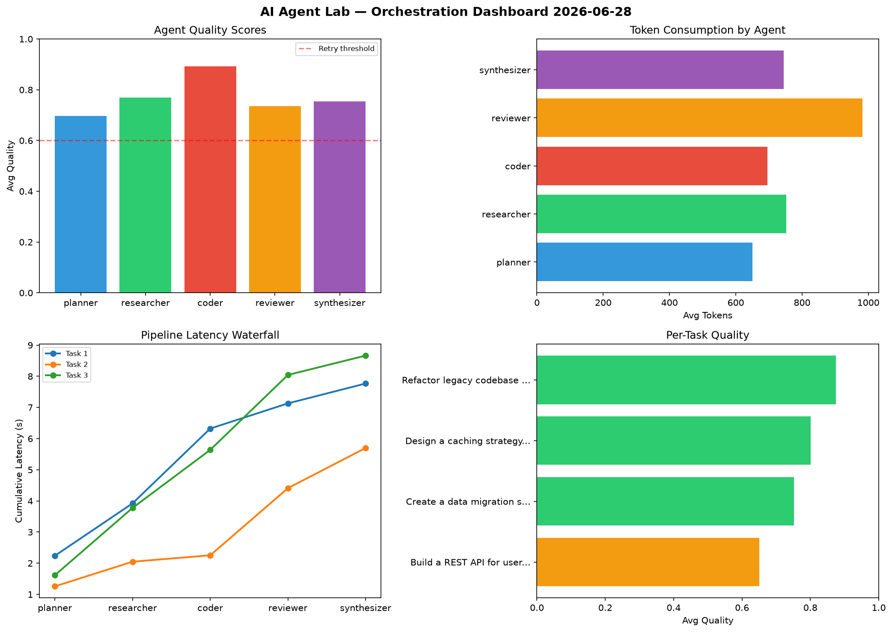

# AI Agent Lab — Orchestration Report 2026-06-28

**Run ID:** `30ee0aacba` | **Tasks:** 4 | **Avg Quality:** 0.77

## Aggregate Metrics

| Metric | Value |
|--------|-------|
| avg_latency | 7.064 |
| total_tokens | 15300 |
| avg_quality | 0.77 |

## Delta vs Yesterday

| Metric | Today | Yesterday | Change |
|--------|-------|-----------|--------|
| avg_latency | 7.064 | 7.073 | 📉 -0.1% |
| total_tokens | 15300 | 14869 | 📈 2.9% |
| avg_quality | 0.77 | 0.737 | 📈 4.5% |

## Pipeline Results

### Build a REST API for user authentication
| Agent | Quality | Latency | Tokens | Status |
|-------|---------|---------|--------|--------|
| planner | 0.544 | 2.239s | 722 | needs_retry |
| researcher | 0.592 | 1.683s | 851 | needs_retry |
| coder | 0.967 | 2.4s | 802 | success |
| reviewer | 0.631 | 0.808s | 1202 | success |
| synthesizer | 0.518 | 0.638s | 545 | needs_retry |

### Create a data migration script for schema v2
| Agent | Quality | Latency | Tokens | Status |
|-------|---------|---------|--------|--------|
| planner | 0.521 | 1.258s | 906 | needs_retry |
| researcher | 0.87 | 0.791s | 956 | success |
| coder | 0.825 | 0.205s | 906 | success |
| reviewer | 0.59 | 2.155s | 652 | needs_retry |
| synthesizer | 0.955 | 1.29s | 924 | success |

### Design a caching strategy for high-traffic endpoints
| Agent | Quality | Latency | Tokens | Status |
|-------|---------|---------|--------|--------|
| planner | 0.899 | 1.616s | 386 | success |
| researcher | 0.62 | 2.16s | 668 | success |
| coder | 0.973 | 1.862s | 359 | success |
| reviewer | 0.956 | 2.405s | 1082 | success |
| synthesizer | 0.555 | 0.621s | 776 | needs_retry |

### Refactor legacy codebase to use dependency injection
| Agent | Quality | Latency | Tokens | Status |
|-------|---------|---------|--------|--------|
| planner | 0.826 | 1.931s | 589 | success |
| researcher | 0.997 | 1.307s | 537 | success |
| coder | 0.802 | 0.344s | 713 | success |
| reviewer | 0.764 | 1.399s | 993 | success |
| synthesizer | 0.986 | 1.143s | 731 | success |
