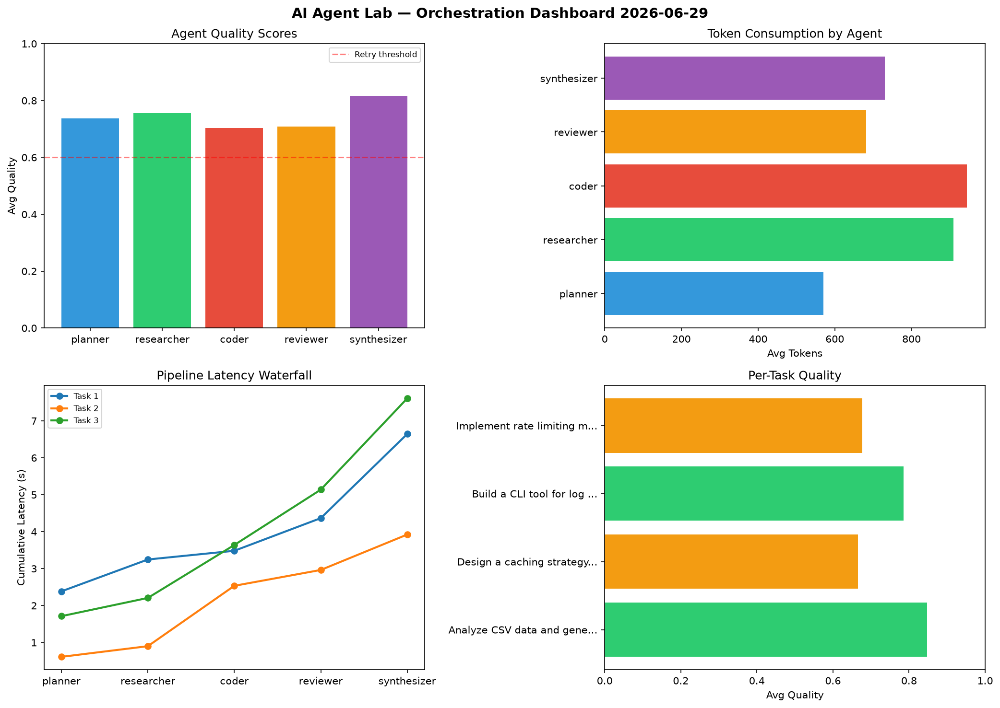

# AI Agent Lab — Orchestration Report 2026-06-29

**Run ID:** `4bc433a404` | **Tasks:** 4 | **Avg Quality:** 0.744

## Aggregate Metrics

| Metric | Value |
|--------|-------|
| avg_latency | 6.022 |
| total_tokens | 15343 |
| avg_quality | 0.744 |

## Delta vs Yesterday

| Metric | Today | Yesterday | Change |
|--------|-------|-----------|--------|
| avg_latency | 6.022 | 5.405 | 📈 11.4% |
| total_tokens | 15343 | 14290 | 📈 7.4% |
| avg_quality | 0.744 | 0.739 | 📈 0.7% |

## Pipeline Results

### Analyze CSV data and generate statistical summary
| Agent | Quality | Latency | Tokens | Status |
|-------|---------|---------|--------|--------|
| planner | 0.916 | 2.385s | 568 | success |
| researcher | 0.91 | 0.862s | 1005 | success |
| coder | 0.839 | 0.236s | 1029 | success |
| reviewer | 0.68 | 0.884s | 656 | success |
| synthesizer | 0.892 | 2.278s | 183 | success |

### Design a caching strategy for high-traffic endpoints
| Agent | Quality | Latency | Tokens | Status |
|-------|---------|---------|--------|--------|
| planner | 0.741 | 0.612s | 433 | success |
| researcher | 0.737 | 0.289s | 977 | success |
| coder | 0.566 | 1.634s | 556 | needs_retry |
| reviewer | 0.615 | 0.429s | 883 | success |
| synthesizer | 0.673 | 0.959s | 544 | success |

### Build a CLI tool for log analysis
| Agent | Quality | Latency | Tokens | Status |
|-------|---------|---------|--------|--------|
| planner | 0.612 | 1.713s | 916 | success |
| researcher | 0.575 | 0.494s | 992 | needs_retry |
| coder | 0.843 | 1.433s | 1176 | success |
| reviewer | 0.97 | 1.498s | 367 | success |
| synthesizer | 0.925 | 2.471s | 1014 | success |

### Implement rate limiting middleware
| Agent | Quality | Latency | Tokens | Status |
|-------|---------|---------|--------|--------|
| planner | 0.68 | 0.344s | 364 | success |
| researcher | 0.799 | 1.093s | 662 | success |
| coder | 0.565 | 2.375s | 1018 | needs_retry |
| reviewer | 0.569 | 1.419s | 820 | needs_retry |
| synthesizer | 0.773 | 0.68s | 1180 | success |
