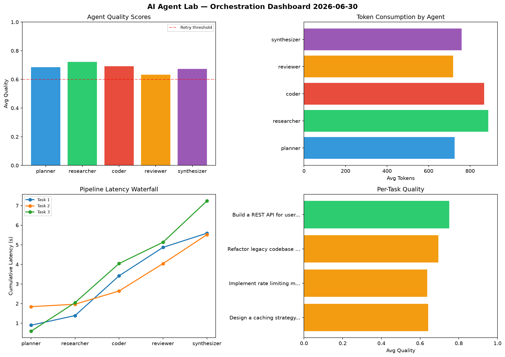

# AI Agent Lab — Orchestration Report 2026-06-30

**Run ID:** `62896e58c3` | **Tasks:** 4 | **Avg Quality:** 0.681

## Aggregate Metrics

| Metric | Value |
|--------|-------|
| avg_latency | 6.461 |
| total_tokens | 15834 |
| avg_quality | 0.681 |

## Delta vs Yesterday

| Metric | Today | Yesterday | Change |
|--------|-------|-----------|--------|
| avg_latency | 6.461 | 6.022 | 📈 7.3% |
| total_tokens | 15834 | 15343 | 📈 3.2% |
| avg_quality | 0.681 | 0.744 | 📉 -8.5% |

## Pipeline Results

### Design a caching strategy for high-traffic endpoints
| Agent | Quality | Latency | Tokens | Status |
|-------|---------|---------|--------|--------|
| planner | 0.633 | 0.895s | 789 | success |
| researcher | 0.766 | 0.492s | 778 | success |
| coder | 0.595 | 2.028s | 943 | needs_retry |
| reviewer | 0.682 | 1.454s | 719 | success |
| synthesizer | 0.533 | 0.724s | 670 | needs_retry |

### Implement rate limiting middleware
| Agent | Quality | Latency | Tokens | Status |
|-------|---------|---------|--------|--------|
| planner | 0.681 | 1.842s | 714 | success |
| researcher | 0.623 | 0.124s | 1119 | success |
| coder | 0.826 | 0.675s | 797 | success |
| reviewer | 0.538 | 1.4s | 747 | needs_retry |
| synthesizer | 0.517 | 1.479s | 699 | needs_retry |

### Refactor legacy codebase to use dependency injection
| Agent | Quality | Latency | Tokens | Status |
|-------|---------|---------|--------|--------|
| planner | 0.851 | 0.589s | 677 | success |
| researcher | 0.666 | 1.459s | 1005 | success |
| coder | 0.719 | 1.995s | 755 | success |
| reviewer | 0.557 | 1.088s | 732 | needs_retry |
| synthesizer | 0.675 | 2.112s | 897 | success |

### Build a REST API for user authentication
| Agent | Quality | Latency | Tokens | Status |
|-------|---------|---------|--------|--------|
| planner | 0.574 | 0.727s | 723 | needs_retry |
| researcher | 0.833 | 1.49s | 648 | success |
| coder | 0.627 | 1.957s | 975 | success |
| reviewer | 0.752 | 2.307s | 677 | success |
| synthesizer | 0.97 | 1.006s | 770 | success |
