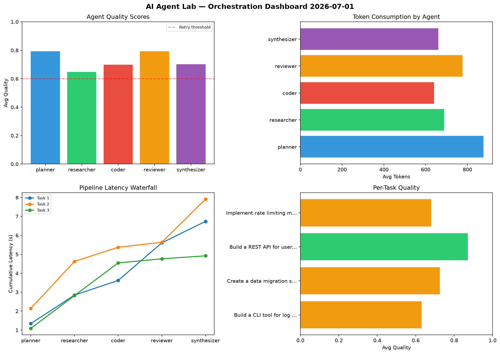

# AI Agent Lab — Orchestration Report 2026-07-01

**Run ID:** `2d5e26dd9d` | **Tasks:** 4 | **Avg Quality:** 0.727

## Aggregate Metrics

| Metric | Value |
|--------|-------|
| avg_latency | 6.578 |
| total_tokens | 14573 |
| avg_quality | 0.727 |

## Delta vs Yesterday

| Metric | Today | Yesterday | Change |
|--------|-------|-----------|--------|
| avg_latency | 6.578 | 5.401 | 📈 21.8% |
| total_tokens | 14573 | 14653 | 📉 -0.5% |
| avg_quality | 0.727 | 0.758 | 📉 -4.1% |

## Pipeline Results

### Build a CLI tool for log analysis
| Agent | Quality | Latency | Tokens | Status |
|-------|---------|---------|--------|--------|
| planner | 0.595 | 1.345s | 929 | needs_retry |
| researcher | 0.648 | 1.502s | 756 | success |
| coder | 0.632 | 0.773s | 556 | success |
| reviewer | 0.57 | 1.987s | 863 | needs_retry |
| synthesizer | 0.706 | 1.131s | 851 | success |

### Create a data migration script for schema v2
| Agent | Quality | Latency | Tokens | Status |
|-------|---------|---------|--------|--------|
| planner | 0.988 | 2.144s | 487 | success |
| researcher | 0.629 | 2.48s | 872 | success |
| coder | 0.502 | 0.746s | 1077 | needs_retry |
| reviewer | 0.905 | 0.265s | 431 | success |
| synthesizer | 0.602 | 2.275s | 703 | success |

### Build a REST API for user authentication
| Agent | Quality | Latency | Tokens | Status |
|-------|---------|---------|--------|--------|
| planner | 0.991 | 1.089s | 964 | success |
| researcher | 0.685 | 1.734s | 325 | success |
| coder | 0.803 | 1.721s | 465 | success |
| reviewer | 0.894 | 0.219s | 653 | success |
| synthesizer | 0.984 | 0.157s | 388 | success |

### Implement rate limiting middleware
| Agent | Quality | Latency | Tokens | Status |
|-------|---------|---------|--------|--------|
| planner | 0.598 | 2.223s | 1126 | needs_retry |
| researcher | 0.627 | 1.324s | 802 | success |
| coder | 0.86 | 0.887s | 463 | success |
| reviewer | 0.805 | 0.771s | 1159 | success |
| synthesizer | 0.514 | 1.538s | 703 | needs_retry |
