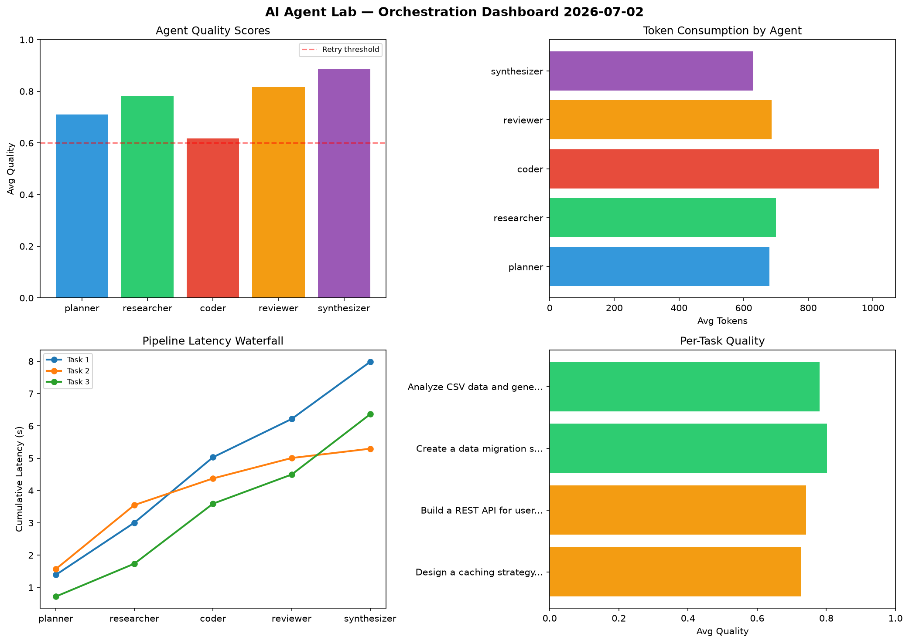

# AI Agent Lab — Orchestration Report 2026-07-02

**Run ID:** `b69b9e4ec0` | **Tasks:** 4 | **Avg Quality:** 0.763

## Aggregate Metrics

| Metric | Value |
|--------|-------|
| avg_latency | 6.518 |
| total_tokens | 14858 |
| avg_quality | 0.763 |

## Delta vs Yesterday

| Metric | Today | Yesterday | Change |
|--------|-------|-----------|--------|
| avg_latency | 6.518 | 6.578 | 📉 -0.9% |
| total_tokens | 14858 | 14573 | 📈 2.0% |
| avg_quality | 0.763 | 0.727 | 📈 5.0% |

## Pipeline Results

### Design a caching strategy for high-traffic endpoints
| Agent | Quality | Latency | Tokens | Status |
|-------|---------|---------|--------|--------|
| planner | 0.612 | 1.39s | 808 | success |
| researcher | 0.764 | 1.617s | 608 | success |
| coder | 0.508 | 2.024s | 1266 | needs_retry |
| reviewer | 0.797 | 1.184s | 783 | success |
| synthesizer | 0.953 | 1.771s | 878 | success |

### Build a REST API for user authentication
| Agent | Quality | Latency | Tokens | Status |
|-------|---------|---------|--------|--------|
| planner | 0.835 | 1.569s | 332 | success |
| researcher | 0.605 | 1.983s | 1153 | success |
| coder | 0.714 | 0.823s | 683 | success |
| reviewer | 0.665 | 0.632s | 381 | success |
| synthesizer | 0.884 | 0.289s | 808 | success |

### Create a data migration script for schema v2
| Agent | Quality | Latency | Tokens | Status |
|-------|---------|---------|--------|--------|
| planner | 0.742 | 0.719s | 756 | success |
| researcher | 0.869 | 1.018s | 446 | success |
| coder | 0.593 | 1.857s | 1000 | needs_retry |
| reviewer | 0.894 | 0.901s | 793 | success |
| synthesizer | 0.912 | 1.869s | 498 | success |

### Analyze CSV data and generate statistical summary
| Agent | Quality | Latency | Tokens | Status |
|-------|---------|---------|--------|--------|
| planner | 0.653 | 1.36s | 822 | success |
| researcher | 0.892 | 1.81s | 593 | success |
| coder | 0.653 | 2.035s | 1126 | success |
| reviewer | 0.91 | 0.378s | 791 | success |
| synthesizer | 0.796 | 0.844s | 333 | success |
