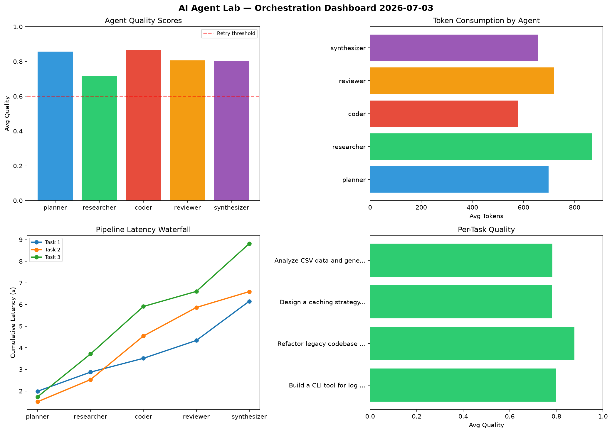

# AI Agent Lab — Orchestration Report 2026-07-03

**Run ID:** `cb5bfc4fff` | **Tasks:** 4 | **Avg Quality:** 0.81

## Aggregate Metrics

| Metric | Value |
|--------|-------|
| avg_latency | 7.023 |
| total_tokens | 14080 |
| avg_quality | 0.81 |

## Delta vs Yesterday

| Metric | Today | Yesterday | Change |
|--------|-------|-----------|--------|
| avg_latency | 7.023 | 6.071 | 📈 15.7% |
| total_tokens | 14080 | 14875 | 📉 -5.3% |
| avg_quality | 0.81 | 0.731 | 📈 10.8% |

## Pipeline Results

### Build a CLI tool for log analysis
| Agent | Quality | Latency | Tokens | Status |
|-------|---------|---------|--------|--------|
| planner | 0.913 | 1.989s | 564 | success |
| researcher | 0.727 | 0.884s | 976 | success |
| coder | 0.835 | 0.64s | 814 | success |
| reviewer | 0.761 | 0.825s | 710 | success |
| synthesizer | 0.762 | 1.814s | 464 | success |

### Refactor legacy codebase to use dependency injection
| Agent | Quality | Latency | Tokens | Status |
|-------|---------|---------|--------|--------|
| planner | 0.821 | 1.505s | 929 | success |
| researcher | 0.755 | 1.021s | 850 | success |
| coder | 0.951 | 2.018s | 330 | success |
| reviewer | 0.879 | 1.32s | 522 | success |
| synthesizer | 0.982 | 0.734s | 606 | success |

### Design a caching strategy for high-traffic endpoints
| Agent | Quality | Latency | Tokens | Status |
|-------|---------|---------|--------|--------|
| planner | 0.97 | 1.732s | 524 | success |
| researcher | 0.76 | 1.981s | 681 | success |
| coder | 0.741 | 2.198s | 868 | success |
| reviewer | 0.92 | 0.696s | 739 | success |
| synthesizer | 0.508 | 2.21s | 978 | needs_retry |

### Analyze CSV data and generate statistical summary
| Agent | Quality | Latency | Tokens | Status |
|-------|---------|---------|--------|--------|
| planner | 0.721 | 2.093s | 776 | success |
| researcher | 0.617 | 1.671s | 962 | success |
| coder | 0.942 | 0.689s | 301 | success |
| reviewer | 0.667 | 0.811s | 909 | success |
| synthesizer | 0.966 | 1.26s | 577 | success |
