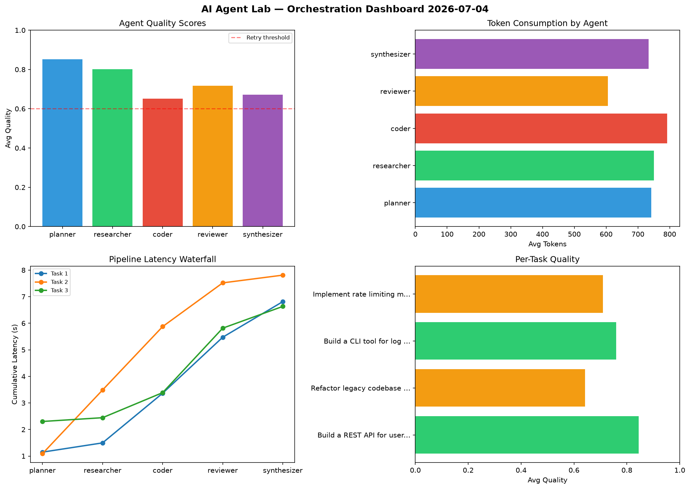

# AI Agent Lab — Orchestration Report 2026-07-04

**Run ID:** `0f7d305e31` | **Tasks:** 4 | **Avg Quality:** 0.739

## Aggregate Metrics

| Metric | Value |
|--------|-------|
| avg_latency | 7.285 |
| total_tokens | 14494 |
| avg_quality | 0.739 |

## Delta vs Yesterday

| Metric | Today | Yesterday | Change |
|--------|-------|-----------|--------|
| avg_latency | 7.285 | 6.682 | 📈 9.0% |
| total_tokens | 14494 | 14247 | 📈 1.7% |
| avg_quality | 0.739 | 0.727 | 📈 1.7% |

## Pipeline Results

### Build a REST API for user authentication
| Agent | Quality | Latency | Tokens | Status |
|-------|---------|---------|--------|--------|
| planner | 0.967 | 1.148s | 1025 | success |
| researcher | 0.826 | 0.348s | 823 | success |
| coder | 0.741 | 1.869s | 662 | success |
| reviewer | 0.719 | 2.108s | 686 | success |
| synthesizer | 0.97 | 1.34s | 1180 | success |

### Refactor legacy codebase to use dependency injection
| Agent | Quality | Latency | Tokens | Status |
|-------|---------|---------|--------|--------|
| planner | 0.629 | 1.09s | 734 | success |
| researcher | 0.8 | 2.396s | 521 | success |
| coder | 0.533 | 2.387s | 956 | needs_retry |
| reviewer | 0.734 | 1.646s | 461 | success |
| synthesizer | 0.514 | 0.291s | 259 | needs_retry |

### Build a CLI tool for log analysis
| Agent | Quality | Latency | Tokens | Status |
|-------|---------|---------|--------|--------|
| planner | 0.92 | 2.302s | 689 | success |
| researcher | 0.929 | 0.142s | 1168 | success |
| coder | 0.602 | 0.943s | 1147 | success |
| reviewer | 0.808 | 2.427s | 339 | success |
| synthesizer | 0.534 | 0.819s | 821 | needs_retry |

### Implement rate limiting middleware
| Agent | Quality | Latency | Tokens | Status |
|-------|---------|---------|--------|--------|
| planner | 0.892 | 1.765s | 519 | success |
| researcher | 0.651 | 0.39s | 490 | success |
| coder | 0.726 | 2.332s | 403 | success |
| reviewer | 0.606 | 2.35s | 937 | success |
| synthesizer | 0.67 | 1.049s | 674 | success |
