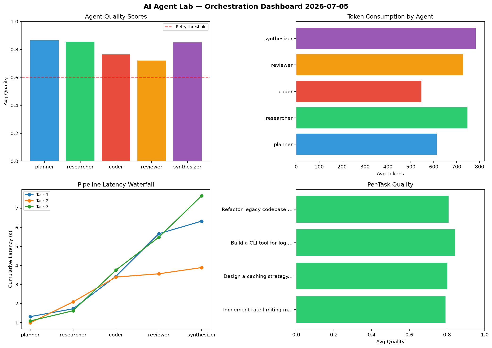

# AI Agent Lab — Orchestration Report 2026-07-05

**Run ID:** `e0b8fc028d` | **Tasks:** 4 | **Avg Quality:** 0.812

## Aggregate Metrics

| Metric | Value |
|--------|-------|
| avg_latency | 5.739 |
| total_tokens | 13674 |
| avg_quality | 0.812 |

## Delta vs Yesterday

| Metric | Today | Yesterday | Change |
|--------|-------|-----------|--------|
| avg_latency | 5.739 | 7.07 | 📉 -18.8% |
| total_tokens | 13674 | 12912 | 📈 5.9% |
| avg_quality | 0.812 | 0.737 | 📈 10.2% |

## Pipeline Results

### Implement rate limiting middleware
| Agent | Quality | Latency | Tokens | Status |
|-------|---------|---------|--------|--------|
| planner | 0.727 | 1.308s | 413 | success |
| researcher | 0.826 | 0.413s | 704 | success |
| coder | 0.877 | 1.709s | 612 | success |
| reviewer | 0.644 | 2.238s | 729 | success |
| synthesizer | 0.884 | 0.662s | 502 | success |

### Design a caching strategy for high-traffic endpoints
| Agent | Quality | Latency | Tokens | Status |
|-------|---------|---------|--------|--------|
| planner | 0.93 | 0.98s | 499 | success |
| researcher | 0.817 | 1.104s | 448 | success |
| coder | 0.623 | 1.305s | 403 | success |
| reviewer | 0.653 | 0.172s | 1153 | success |
| synthesizer | 0.986 | 0.328s | 966 | success |

### Build a CLI tool for log analysis
| Agent | Quality | Latency | Tokens | Status |
|-------|---------|---------|--------|--------|
| planner | 0.848 | 1.082s | 645 | success |
| researcher | 0.953 | 0.534s | 789 | success |
| coder | 0.761 | 2.142s | 766 | success |
| reviewer | 0.996 | 1.724s | 710 | success |
| synthesizer | 0.656 | 2.18s | 783 | success |

### Refactor legacy codebase to use dependency injection
| Agent | Quality | Latency | Tokens | Status |
|-------|---------|---------|--------|--------|
| planner | 0.955 | 0.155s | 898 | success |
| researcher | 0.828 | 0.796s | 1047 | success |
| coder | 0.798 | 1.682s | 403 | success |
| reviewer | 0.586 | 0.197s | 322 | needs_retry |
| synthesizer | 0.877 | 2.246s | 882 | success |
