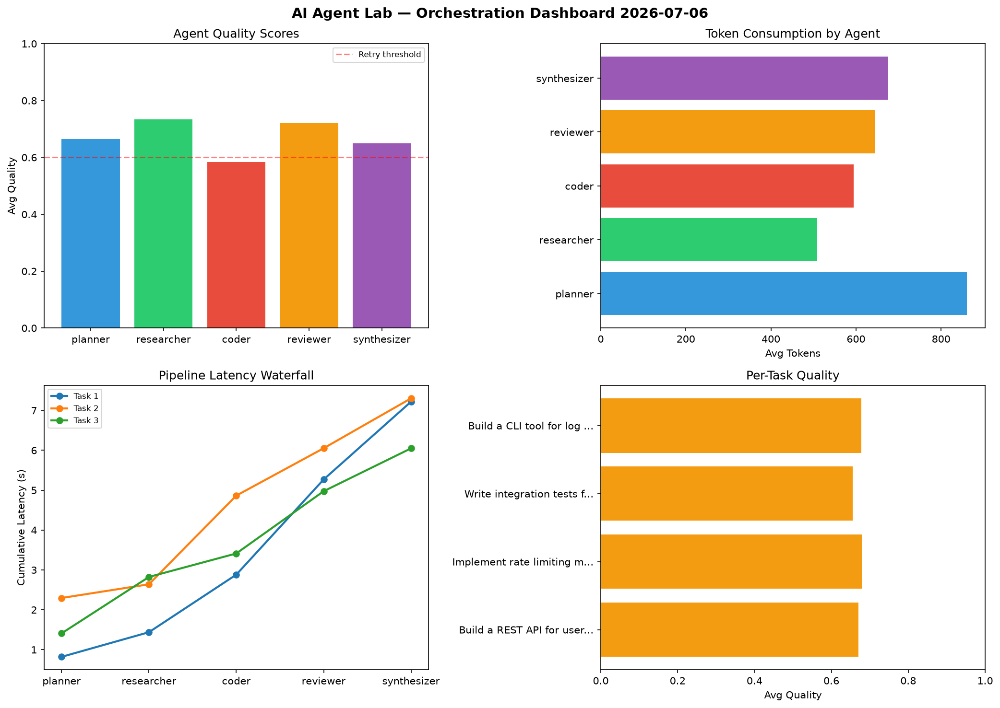

# AI Agent Lab — Orchestration Report 2026-07-06

**Run ID:** `7b0183cff9` | **Tasks:** 4 | **Avg Quality:** 0.671

## Aggregate Metrics

| Metric | Value |
|--------|-------|
| avg_latency | 7.171 |
| total_tokens | 13133 |
| avg_quality | 0.671 |

## Delta vs Yesterday

| Metric | Today | Yesterday | Change |
|--------|-------|-----------|--------|
| avg_latency | 7.171 | 5.976 | 📈 20.0% |
| total_tokens | 13133 | 14592 | 📉 -10.0% |
| avg_quality | 0.671 | 0.746 | 📉 -10.1% |

## Pipeline Results

### Build a REST API for user authentication
| Agent | Quality | Latency | Tokens | Status |
|-------|---------|---------|--------|--------|
| planner | 0.582 | 0.82s | 878 | needs_retry |
| researcher | 0.661 | 0.618s | 221 | success |
| coder | 0.791 | 1.444s | 229 | success |
| reviewer | 0.736 | 2.387s | 602 | success |
| synthesizer | 0.581 | 1.95s | 564 | needs_retry |

### Implement rate limiting middleware
| Agent | Quality | Latency | Tokens | Status |
|-------|---------|---------|--------|--------|
| planner | 0.769 | 2.296s | 906 | success |
| researcher | 0.665 | 0.344s | 795 | success |
| coder | 0.504 | 2.224s | 613 | needs_retry |
| reviewer | 0.86 | 1.188s | 630 | success |
| synthesizer | 0.596 | 1.251s | 646 | needs_retry |

### Write integration tests for payment processing module
| Agent | Quality | Latency | Tokens | Status |
|-------|---------|---------|--------|--------|
| planner | 0.564 | 1.409s | 628 | needs_retry |
| researcher | 0.979 | 1.415s | 363 | success |
| coder | 0.518 | 0.589s | 766 | needs_retry |
| reviewer | 0.516 | 1.561s | 766 | needs_retry |
| synthesizer | 0.698 | 1.075s | 847 | success |

### Build a CLI tool for log analysis
| Agent | Quality | Latency | Tokens | Status |
|-------|---------|---------|--------|--------|
| planner | 0.741 | 1.431s | 1030 | success |
| researcher | 0.633 | 2.205s | 654 | success |
| coder | 0.524 | 1.835s | 771 | needs_retry |
| reviewer | 0.768 | 0.811s | 578 | success |
| synthesizer | 0.726 | 1.832s | 646 | success |
