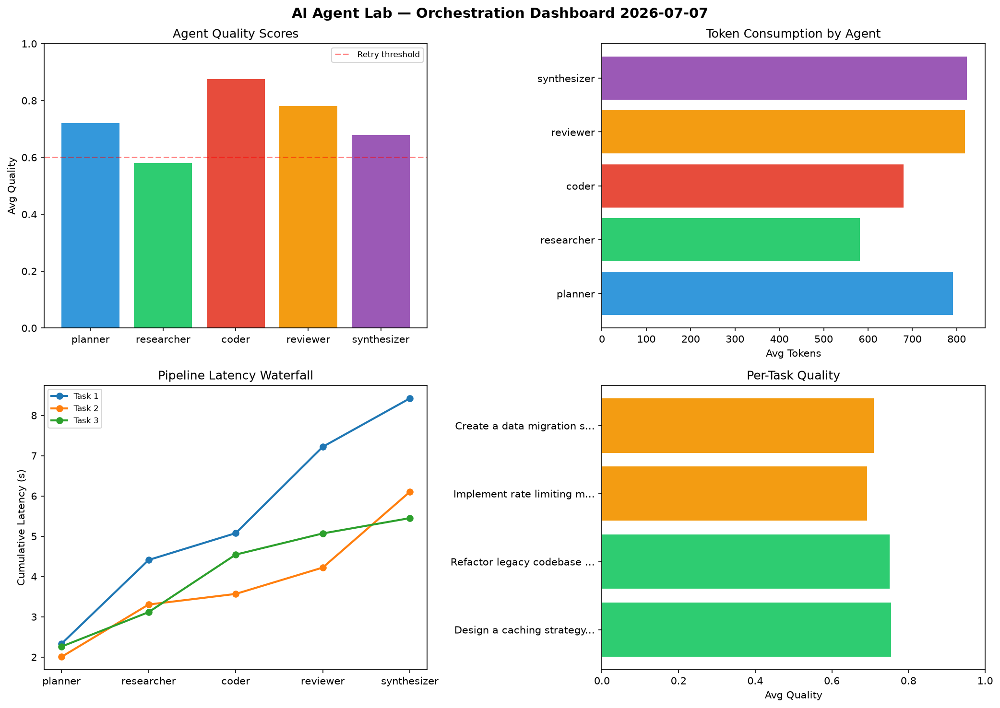

# AI Agent Lab — Orchestration Report 2026-07-07

**Run ID:** `d888251a67` | **Tasks:** 4 | **Avg Quality:** 0.727

## Aggregate Metrics

| Metric | Value |
|--------|-------|
| avg_latency | 6.901 |
| total_tokens | 14782 |
| avg_quality | 0.727 |

## Delta vs Yesterday

| Metric | Today | Yesterday | Change |
|--------|-------|-----------|--------|
| avg_latency | 6.901 | 7.171 | 📉 -3.8% |
| total_tokens | 14782 | 13133 | 📈 12.6% |
| avg_quality | 0.727 | 0.671 | 📈 8.3% |

## Pipeline Results

### Design a caching strategy for high-traffic endpoints
| Agent | Quality | Latency | Tokens | Status |
|-------|---------|---------|--------|--------|
| planner | 0.922 | 2.332s | 453 | success |
| researcher | 0.507 | 2.079s | 473 | needs_retry |
| coder | 0.774 | 0.666s | 836 | success |
| reviewer | 0.809 | 2.144s | 1084 | success |
| synthesizer | 0.762 | 1.202s | 1052 | success |

### Refactor legacy codebase to use dependency injection
| Agent | Quality | Latency | Tokens | Status |
|-------|---------|---------|--------|--------|
| planner | 0.717 | 2.006s | 873 | success |
| researcher | 0.599 | 1.299s | 908 | needs_retry |
| coder | 0.989 | 0.263s | 717 | success |
| reviewer | 0.863 | 0.655s | 302 | success |
| synthesizer | 0.589 | 1.88s | 648 | needs_retry |

### Implement rate limiting middleware
| Agent | Quality | Latency | Tokens | Status |
|-------|---------|---------|--------|--------|
| planner | 0.584 | 2.261s | 993 | needs_retry |
| researcher | 0.605 | 0.855s | 392 | success |
| coder | 0.74 | 1.428s | 762 | success |
| reviewer | 0.813 | 0.526s | 708 | success |
| synthesizer | 0.716 | 0.38s | 944 | success |

### Create a data migration script for schema v2
| Agent | Quality | Latency | Tokens | Status |
|-------|---------|---------|--------|--------|
| planner | 0.657 | 2.27s | 848 | success |
| researcher | 0.609 | 1.709s | 555 | success |
| coder | 0.996 | 1.693s | 406 | success |
| reviewer | 0.639 | 1.43s | 1180 | success |
| synthesizer | 0.649 | 0.526s | 648 | success |
