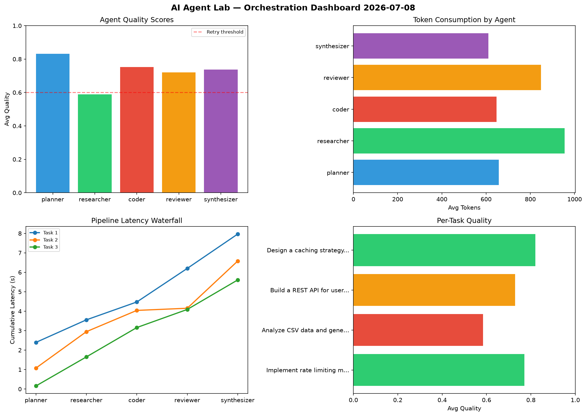

# AI Agent Lab — Orchestration Report 2026-07-08

**Run ID:** `4e5b4c3001` | **Tasks:** 4 | **Avg Quality:** 0.726

## Aggregate Metrics

| Metric | Value |
|--------|-------|
| avg_latency | 6.609 |
| total_tokens | 14872 |
| avg_quality | 0.726 |

## Delta vs Yesterday

| Metric | Today | Yesterday | Change |
|--------|-------|-----------|--------|
| avg_latency | 6.609 | 6.499 | 📈 1.7% |
| total_tokens | 14872 | 12266 | 📈 21.2% |
| avg_quality | 0.726 | 0.729 | 📉 -0.4% |

## Pipeline Results

### Implement rate limiting middleware
| Agent | Quality | Latency | Tokens | Status |
|-------|---------|---------|--------|--------|
| planner | 0.811 | 2.397s | 326 | success |
| researcher | 0.588 | 1.159s | 556 | needs_retry |
| coder | 0.971 | 0.918s | 664 | success |
| reviewer | 0.573 | 1.725s | 814 | needs_retry |
| synthesizer | 0.914 | 1.766s | 429 | success |

### Analyze CSV data and generate statistical summary
| Agent | Quality | Latency | Tokens | Status |
|-------|---------|---------|--------|--------|
| planner | 0.684 | 1.077s | 720 | success |
| researcher | 0.558 | 1.871s | 1107 | needs_retry |
| coder | 0.504 | 1.093s | 573 | needs_retry |
| reviewer | 0.544 | 0.111s | 1092 | needs_retry |
| synthesizer | 0.629 | 2.425s | 983 | success |

### Build a REST API for user authentication
| Agent | Quality | Latency | Tokens | Status |
|-------|---------|---------|--------|--------|
| planner | 0.879 | 0.158s | 585 | success |
| researcher | 0.648 | 1.493s | 1007 | success |
| coder | 0.573 | 1.509s | 956 | needs_retry |
| reviewer | 0.924 | 0.93s | 728 | success |
| synthesizer | 0.619 | 1.516s | 514 | success |

### Design a caching strategy for high-traffic endpoints
| Agent | Quality | Latency | Tokens | Status |
|-------|---------|---------|--------|--------|
| planner | 0.954 | 1.854s | 998 | success |
| researcher | 0.562 | 0.802s | 1152 | needs_retry |
| coder | 0.961 | 0.151s | 395 | success |
| reviewer | 0.838 | 1.676s | 760 | success |
| synthesizer | 0.784 | 1.807s | 513 | success |
