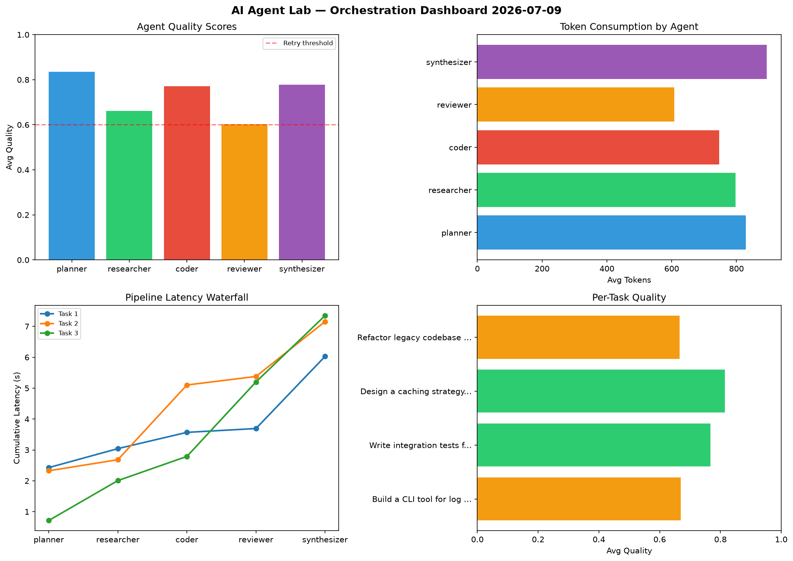

# AI Agent Lab — Orchestration Report 2026-07-09

**Run ID:** `406bed9f66` | **Tasks:** 4 | **Avg Quality:** 0.729

## Aggregate Metrics

| Metric | Value |
|--------|-------|
| avg_latency | 6.873 |
| total_tokens | 15499 |
| avg_quality | 0.729 |

## Delta vs Yesterday

| Metric | Today | Yesterday | Change |
|--------|-------|-----------|--------|
| avg_latency | 6.873 | 7.512 | 📉 -8.5% |
| total_tokens | 15499 | 14912 | 📈 3.9% |
| avg_quality | 0.729 | 0.722 | 📈 1.0% |

## Pipeline Results

### Build a CLI tool for log analysis
| Agent | Quality | Latency | Tokens | Status |
|-------|---------|---------|--------|--------|
| planner | 0.589 | 2.428s | 755 | needs_retry |
| researcher | 0.687 | 0.614s | 1004 | success |
| coder | 0.891 | 0.527s | 599 | success |
| reviewer | 0.603 | 0.124s | 746 | success |
| synthesizer | 0.58 | 2.335s | 1277 | needs_retry |

### Write integration tests for payment processing module
| Agent | Quality | Latency | Tokens | Status |
|-------|---------|---------|--------|--------|
| planner | 0.884 | 2.325s | 506 | success |
| researcher | 0.561 | 0.358s | 660 | needs_retry |
| coder | 0.735 | 2.42s | 859 | success |
| reviewer | 0.667 | 0.276s | 766 | success |
| synthesizer | 0.988 | 1.777s | 639 | success |

### Design a caching strategy for high-traffic endpoints
| Agent | Quality | Latency | Tokens | Status |
|-------|---------|---------|--------|--------|
| planner | 0.973 | 0.716s | 1196 | success |
| researcher | 0.792 | 1.291s | 413 | success |
| coder | 0.85 | 0.783s | 1018 | success |
| reviewer | 0.58 | 2.411s | 370 | needs_retry |
| synthesizer | 0.878 | 2.147s | 1011 | success |

### Refactor legacy codebase to use dependency injection
| Agent | Quality | Latency | Tokens | Status |
|-------|---------|---------|--------|--------|
| planner | 0.895 | 2.132s | 860 | success |
| researcher | 0.603 | 1.969s | 1112 | success |
| coder | 0.609 | 1.202s | 513 | success |
| reviewer | 0.558 | 0.243s | 548 | needs_retry |
| synthesizer | 0.663 | 1.413s | 647 | success |
