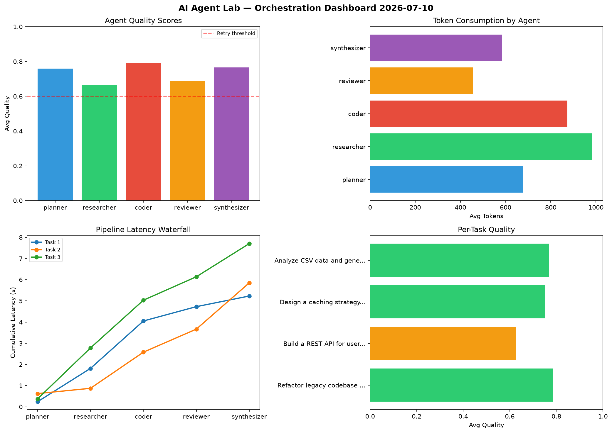

# AI Agent Lab — Orchestration Report 2026-07-10

**Run ID:** `75b3f415a0` | **Tasks:** 4 | **Avg Quality:** 0.733

## Aggregate Metrics

| Metric | Value |
|--------|-------|
| avg_latency | 6.336 |
| total_tokens | 14294 |
| avg_quality | 0.733 |

## Delta vs Yesterday

| Metric | Today | Yesterday | Change |
|--------|-------|-----------|--------|
| avg_latency | 6.336 | 6.107 | 📈 3.7% |
| total_tokens | 14294 | 14720 | 📉 -2.9% |
| avg_quality | 0.733 | 0.713 | 📈 2.8% |

## Pipeline Results

### Refactor legacy codebase to use dependency injection
| Agent | Quality | Latency | Tokens | Status |
|-------|---------|---------|--------|--------|
| planner | 0.908 | 0.241s | 960 | success |
| researcher | 0.792 | 1.573s | 672 | success |
| coder | 0.955 | 2.238s | 846 | success |
| reviewer | 0.651 | 0.676s | 619 | success |
| synthesizer | 0.622 | 0.502s | 865 | success |

### Build a REST API for user authentication
| Agent | Quality | Latency | Tokens | Status |
|-------|---------|---------|--------|--------|
| planner | 0.589 | 0.625s | 868 | needs_retry |
| researcher | 0.61 | 0.249s | 965 | success |
| coder | 0.552 | 1.706s | 907 | needs_retry |
| reviewer | 0.57 | 1.087s | 568 | needs_retry |
| synthesizer | 0.811 | 2.183s | 709 | success |

### Design a caching strategy for high-traffic endpoints
| Agent | Quality | Latency | Tokens | Status |
|-------|---------|---------|--------|--------|
| planner | 0.855 | 0.375s | 424 | success |
| researcher | 0.726 | 2.405s | 1167 | success |
| coder | 0.808 | 2.253s | 801 | success |
| reviewer | 0.714 | 1.106s | 243 | success |
| synthesizer | 0.658 | 1.564s | 347 | success |

### Analyze CSV data and generate statistical summary
| Agent | Quality | Latency | Tokens | Status |
|-------|---------|---------|--------|--------|
| planner | 0.684 | 1.778s | 459 | success |
| researcher | 0.524 | 2.426s | 1123 | needs_retry |
| coder | 0.841 | 1.192s | 942 | success |
| reviewer | 0.815 | 1.01s | 397 | success |
| synthesizer | 0.975 | 0.153s | 412 | success |
