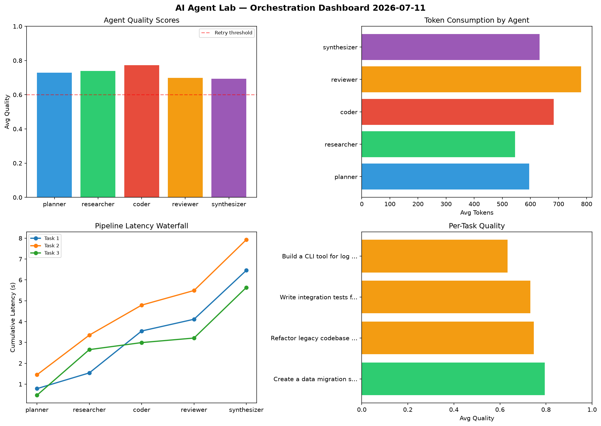

# AI Agent Lab — Orchestration Report 2026-07-11

**Run ID:** `95803207e2` | **Tasks:** 4 | **Avg Quality:** 0.726

## Aggregate Metrics

| Metric | Value |
|--------|-------|
| avg_latency | 6.905 |
| total_tokens | 12942 |
| avg_quality | 0.726 |

## Delta vs Yesterday

| Metric | Today | Yesterday | Change |
|--------|-------|-----------|--------|
| avg_latency | 6.905 | 5.965 | 📈 15.8% |
| total_tokens | 12942 | 15729 | 📉 -17.7% |
| avg_quality | 0.726 | 0.798 | 📉 -9.0% |

## Pipeline Results

### Create a data migration script for schema v2
| Agent | Quality | Latency | Tokens | Status |
|-------|---------|---------|--------|--------|
| planner | 0.715 | 0.786s | 300 | success |
| researcher | 0.974 | 0.755s | 781 | success |
| coder | 0.681 | 2.009s | 551 | success |
| reviewer | 0.71 | 0.563s | 371 | success |
| synthesizer | 0.888 | 2.344s | 1033 | success |

### Refactor legacy codebase to use dependency injection
| Agent | Quality | Latency | Tokens | Status |
|-------|---------|---------|--------|--------|
| planner | 0.854 | 1.45s | 708 | success |
| researcher | 0.865 | 1.902s | 528 | success |
| coder | 0.871 | 1.439s | 607 | success |
| reviewer | 0.582 | 0.7s | 779 | needs_retry |
| synthesizer | 0.563 | 2.437s | 519 | needs_retry |

### Write integration tests for payment processing module
| Agent | Quality | Latency | Tokens | Status |
|-------|---------|---------|--------|--------|
| planner | 0.819 | 0.47s | 728 | success |
| researcher | 0.602 | 2.187s | 605 | success |
| coder | 0.818 | 0.337s | 957 | success |
| reviewer | 0.813 | 0.218s | 1003 | success |
| synthesizer | 0.607 | 2.426s | 403 | success |

### Build a CLI tool for log analysis
| Agent | Quality | Latency | Tokens | Status |
|-------|---------|---------|--------|--------|
| planner | 0.525 | 2.003s | 645 | needs_retry |
| researcher | 0.515 | 1.564s | 266 | needs_retry |
| coder | 0.722 | 1.885s | 616 | success |
| reviewer | 0.69 | 1.004s | 968 | success |
| synthesizer | 0.713 | 1.142s | 574 | success |
