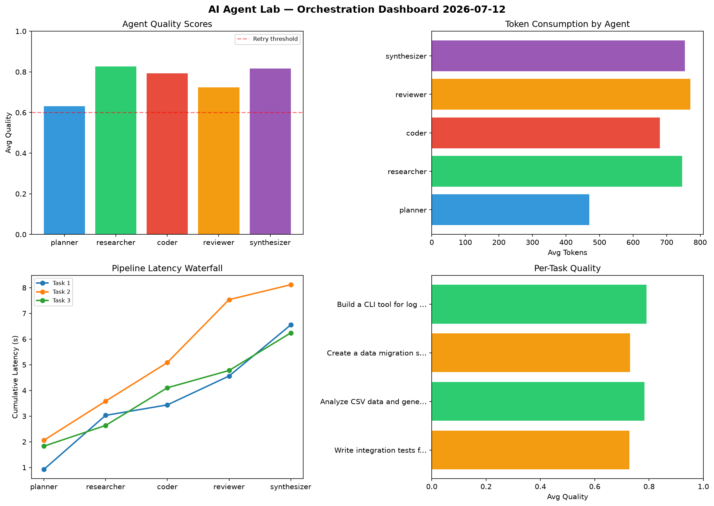

# AI Agent Lab — Orchestration Report 2026-07-12

**Run ID:** `bc86ed7c64` | **Tasks:** 4 | **Avg Quality:** 0.758

## Aggregate Metrics

| Metric | Value |
|--------|-------|
| avg_latency | 6.061 |
| total_tokens | 13682 |
| avg_quality | 0.758 |

## Delta vs Yesterday

| Metric | Today | Yesterday | Change |
|--------|-------|-----------|--------|
| avg_latency | 6.061 | 6.905 | 📉 -12.2% |
| total_tokens | 13682 | 12942 | 📈 5.7% |
| avg_quality | 0.758 | 0.726 | 📈 4.4% |

## Pipeline Results

### Write integration tests for payment processing module
| Agent | Quality | Latency | Tokens | Status |
|-------|---------|---------|--------|--------|
| planner | 0.567 | 0.923s | 329 | needs_retry |
| researcher | 0.797 | 2.106s | 608 | success |
| coder | 0.714 | 0.407s | 904 | success |
| reviewer | 0.692 | 1.125s | 526 | success |
| synthesizer | 0.865 | 1.991s | 220 | success |

### Analyze CSV data and generate statistical summary
| Agent | Quality | Latency | Tokens | Status |
|-------|---------|---------|--------|--------|
| planner | 0.552 | 2.059s | 613 | needs_retry |
| researcher | 0.943 | 1.522s | 1053 | success |
| coder | 0.985 | 1.503s | 653 | success |
| reviewer | 0.843 | 2.452s | 728 | success |
| synthesizer | 0.593 | 0.581s | 808 | needs_retry |

### Create a data migration script for schema v2
| Agent | Quality | Latency | Tokens | Status |
|-------|---------|---------|--------|--------|
| planner | 0.7 | 1.829s | 239 | success |
| researcher | 0.761 | 0.806s | 644 | success |
| coder | 0.749 | 1.468s | 588 | success |
| reviewer | 0.592 | 0.673s | 1027 | needs_retry |
| synthesizer | 0.848 | 1.464s | 1170 | success |

### Build a CLI tool for log analysis
| Agent | Quality | Latency | Tokens | Status |
|-------|---------|---------|--------|--------|
| planner | 0.702 | 0.583s | 698 | success |
| researcher | 0.804 | 1.023s | 680 | success |
| coder | 0.723 | 0.284s | 573 | success |
| reviewer | 0.77 | 1.155s | 803 | success |
| synthesizer | 0.957 | 0.291s | 818 | success |
