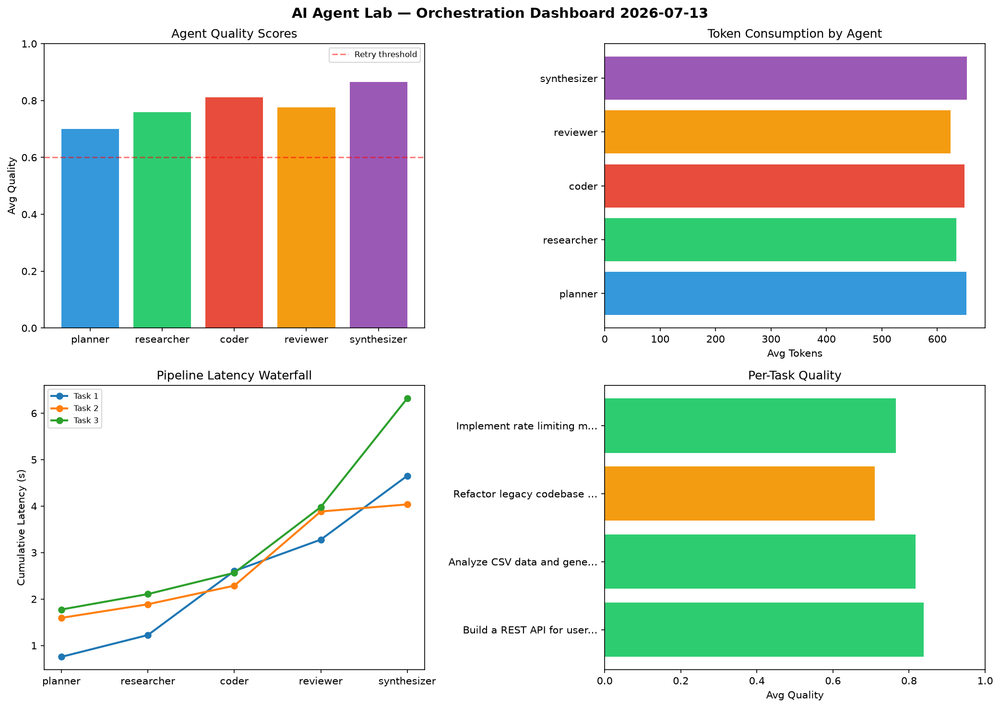

# AI Agent Lab — Orchestration Report 2026-07-13

**Run ID:** `ba28a341ba` | **Tasks:** 4 | **Avg Quality:** 0.782

## Aggregate Metrics

| Metric | Value |
|--------|-------|
| avg_latency | 5.559 |
| total_tokens | 12852 |
| avg_quality | 0.782 |

## Delta vs Yesterday

| Metric | Today | Yesterday | Change |
|--------|-------|-----------|--------|
| avg_latency | 5.559 | 7.094 | 📉 -21.6% |
| total_tokens | 12852 | 16180 | 📉 -20.6% |
| avg_quality | 0.782 | 0.704 | 📈 11.1% |

## Pipeline Results

### Build a REST API for user authentication
| Agent | Quality | Latency | Tokens | Status |
|-------|---------|---------|--------|--------|
| planner | 0.811 | 0.756s | 1001 | success |
| researcher | 0.779 | 0.469s | 282 | success |
| coder | 0.865 | 1.378s | 631 | success |
| reviewer | 0.965 | 0.676s | 734 | success |
| synthesizer | 0.769 | 1.374s | 791 | success |

### Analyze CSV data and generate statistical summary
| Agent | Quality | Latency | Tokens | Status |
|-------|---------|---------|--------|--------|
| planner | 0.702 | 1.595s | 227 | success |
| researcher | 0.933 | 0.293s | 685 | success |
| coder | 0.832 | 0.4s | 722 | success |
| reviewer | 0.648 | 1.597s | 574 | success |
| synthesizer | 0.972 | 0.152s | 684 | success |

### Refactor legacy codebase to use dependency injection
| Agent | Quality | Latency | Tokens | Status |
|-------|---------|---------|--------|--------|
| planner | 0.641 | 1.775s | 938 | success |
| researcher | 0.564 | 0.332s | 1141 | needs_retry |
| coder | 0.849 | 0.458s | 701 | success |
| reviewer | 0.699 | 1.416s | 873 | success |
| synthesizer | 0.795 | 2.339s | 763 | success |

### Implement rate limiting middleware
| Agent | Quality | Latency | Tokens | Status |
|-------|---------|---------|--------|--------|
| planner | 0.648 | 1.028s | 445 | success |
| researcher | 0.762 | 1.116s | 428 | success |
| coder | 0.699 | 1.639s | 541 | success |
| reviewer | 0.79 | 1.819s | 315 | success |
| synthesizer | 0.928 | 1.625s | 376 | success |
