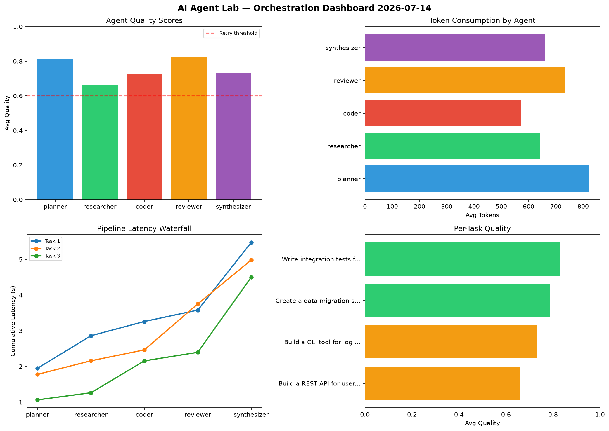

# AI Agent Lab — Orchestration Report 2026-07-14

**Run ID:** `9cacbad4d4` | **Tasks:** 4 | **Avg Quality:** 0.751

## Aggregate Metrics

| Metric | Value |
|--------|-------|
| avg_latency | 5.828 |
| total_tokens | 13707 |
| avg_quality | 0.751 |

## Delta vs Yesterday

| Metric | Today | Yesterday | Change |
|--------|-------|-----------|--------|
| avg_latency | 5.828 | 6.02 | 📉 -3.2% |
| total_tokens | 13707 | 13905 | 📉 -1.4% |
| avg_quality | 0.751 | 0.808 | 📉 -7.1% |

## Pipeline Results

### Build a REST API for user authentication
| Agent | Quality | Latency | Tokens | Status |
|-------|---------|---------|--------|--------|
| planner | 0.514 | 1.951s | 1146 | needs_retry |
| researcher | 0.765 | 0.91s | 281 | success |
| coder | 0.505 | 0.399s | 513 | needs_retry |
| reviewer | 0.893 | 0.32s | 1116 | success |
| synthesizer | 0.623 | 1.893s | 1071 | success |

### Build a CLI tool for log analysis
| Agent | Quality | Latency | Tokens | Status |
|-------|---------|---------|--------|--------|
| planner | 0.836 | 1.779s | 902 | success |
| researcher | 0.679 | 0.381s | 515 | success |
| coder | 0.624 | 0.305s | 347 | success |
| reviewer | 0.787 | 1.289s | 679 | success |
| synthesizer | 0.724 | 1.228s | 906 | success |

### Create a data migration script for schema v2
| Agent | Quality | Latency | Tokens | Status |
|-------|---------|---------|--------|--------|
| planner | 0.973 | 1.065s | 645 | success |
| researcher | 0.591 | 0.199s | 618 | needs_retry |
| coder | 0.803 | 0.894s | 628 | success |
| reviewer | 0.748 | 0.239s | 720 | success |
| synthesizer | 0.814 | 2.106s | 232 | success |

### Write integration tests for payment processing module
| Agent | Quality | Latency | Tokens | Status |
|-------|---------|---------|--------|--------|
| planner | 0.925 | 1.796s | 590 | success |
| researcher | 0.622 | 1.887s | 1156 | success |
| coder | 0.965 | 1.731s | 797 | success |
| reviewer | 0.856 | 1.557s | 417 | success |
| synthesizer | 0.774 | 1.384s | 428 | success |
