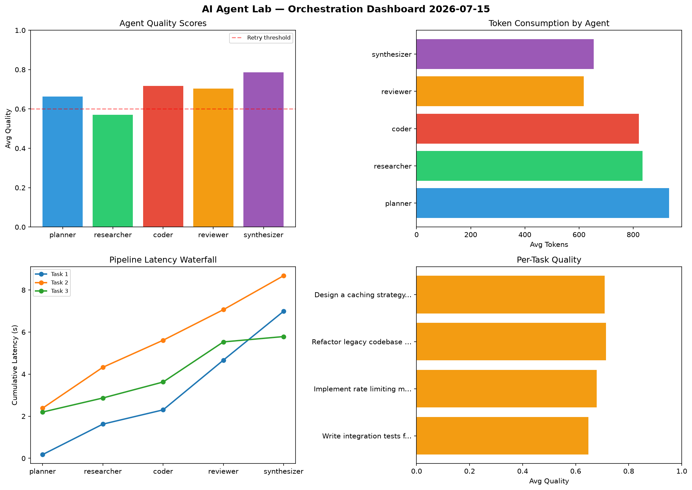

# AI Agent Lab — Orchestration Report 2026-07-15

**Run ID:** `babc0078dd` | **Tasks:** 4 | **Avg Quality:** 0.688

## Aggregate Metrics

| Metric | Value |
|--------|-------|
| avg_latency | 6.942 |
| total_tokens | 15443 |
| avg_quality | 0.688 |

## Delta vs Yesterday

| Metric | Today | Yesterday | Change |
|--------|-------|-----------|--------|
| avg_latency | 6.942 | 5.828 | 📈 19.1% |
| total_tokens | 15443 | 13707 | 📈 12.7% |
| avg_quality | 0.688 | 0.751 | 📉 -8.4% |

## Pipeline Results

### Write integration tests for payment processing module
| Agent | Quality | Latency | Tokens | Status |
|-------|---------|---------|--------|--------|
| planner | 0.557 | 0.176s | 956 | needs_retry |
| researcher | 0.567 | 1.448s | 474 | needs_retry |
| coder | 0.734 | 0.678s | 593 | success |
| reviewer | 0.553 | 2.363s | 1015 | needs_retry |
| synthesizer | 0.828 | 2.325s | 391 | success |

### Implement rate limiting middleware
| Agent | Quality | Latency | Tokens | Status |
|-------|---------|---------|--------|--------|
| planner | 0.681 | 2.382s | 813 | success |
| researcher | 0.526 | 1.944s | 1060 | needs_retry |
| coder | 0.503 | 1.285s | 785 | needs_retry |
| reviewer | 0.872 | 1.453s | 652 | success |
| synthesizer | 0.816 | 1.615s | 1019 | success |

### Refactor legacy codebase to use dependency injection
| Agent | Quality | Latency | Tokens | Status |
|-------|---------|---------|--------|--------|
| planner | 0.639 | 2.198s | 1085 | success |
| researcher | 0.511 | 0.668s | 1156 | needs_retry |
| coder | 0.888 | 0.76s | 859 | success |
| reviewer | 0.804 | 1.906s | 288 | success |
| synthesizer | 0.73 | 0.254s | 405 | success |

### Design a caching strategy for high-traffic endpoints
| Agent | Quality | Latency | Tokens | Status |
|-------|---------|---------|--------|--------|
| planner | 0.775 | 1.34s | 877 | success |
| researcher | 0.675 | 1.388s | 649 | success |
| coder | 0.746 | 0.874s | 1049 | success |
| reviewer | 0.582 | 0.421s | 514 | needs_retry |
| synthesizer | 0.773 | 2.29s | 803 | success |
