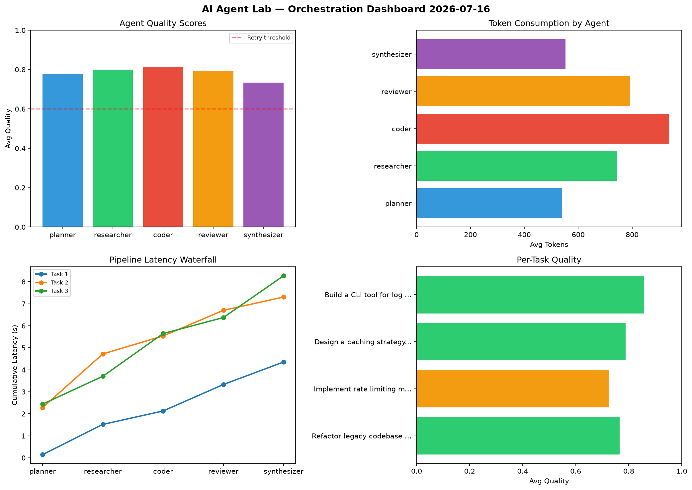

# AI Agent Lab — Orchestration Report 2026-07-16

**Run ID:** `a27e6a073e` | **Tasks:** 4 | **Avg Quality:** 0.784

## Aggregate Metrics

| Metric | Value |
|--------|-------|
| avg_latency | 6.732 |
| total_tokens | 14269 |
| avg_quality | 0.784 |

## Delta vs Yesterday

| Metric | Today | Yesterday | Change |
|--------|-------|-----------|--------|
| avg_latency | 6.732 | 5.351 | 📈 25.8% |
| total_tokens | 14269 | 15835 | 📉 -9.9% |
| avg_quality | 0.784 | 0.699 | 📈 12.2% |

## Pipeline Results

### Refactor legacy codebase to use dependency injection
| Agent | Quality | Latency | Tokens | Status |
|-------|---------|---------|--------|--------|
| planner | 0.786 | 0.146s | 881 | success |
| researcher | 0.673 | 1.372s | 619 | success |
| coder | 0.549 | 0.61s | 796 | needs_retry |
| reviewer | 0.825 | 1.203s | 923 | success |
| synthesizer | 0.998 | 1.024s | 552 | success |

### Implement rate limiting middleware
| Agent | Quality | Latency | Tokens | Status |
|-------|---------|---------|--------|--------|
| planner | 0.616 | 2.282s | 485 | success |
| researcher | 0.819 | 2.44s | 734 | success |
| coder | 0.989 | 0.815s | 1055 | success |
| reviewer | 0.679 | 1.165s | 843 | success |
| synthesizer | 0.519 | 0.606s | 766 | needs_retry |

### Design a caching strategy for high-traffic endpoints
| Agent | Quality | Latency | Tokens | Status |
|-------|---------|---------|--------|--------|
| planner | 0.786 | 2.439s | 386 | success |
| researcher | 0.921 | 1.267s | 1006 | success |
| coder | 0.768 | 1.94s | 908 | success |
| reviewer | 0.934 | 0.728s | 503 | success |
| synthesizer | 0.529 | 1.902s | 263 | needs_retry |

### Build a CLI tool for log analysis
| Agent | Quality | Latency | Tokens | Status |
|-------|---------|---------|--------|--------|
| planner | 0.929 | 2.292s | 409 | success |
| researcher | 0.788 | 1.139s | 615 | success |
| coder | 0.947 | 0.254s | 990 | success |
| reviewer | 0.735 | 2.069s | 905 | success |
| synthesizer | 0.891 | 1.237s | 630 | success |
