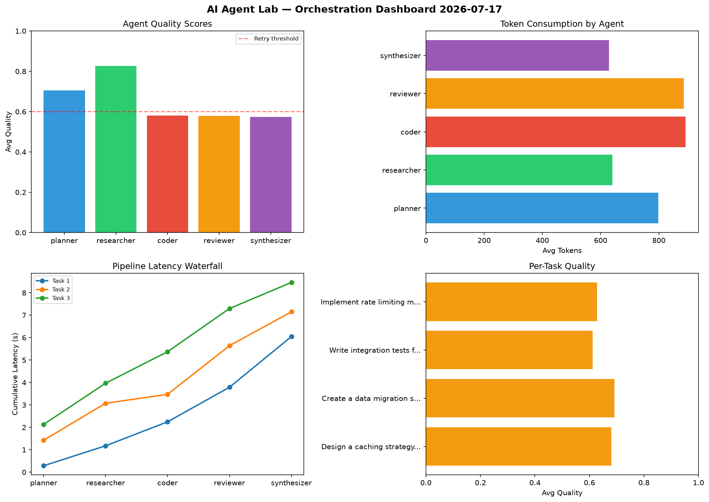

# AI Agent Lab — Orchestration Report 2026-07-17

**Run ID:** `72d35917c9` | **Tasks:** 4 | **Avg Quality:** 0.653

## Aggregate Metrics

| Metric | Value |
|--------|-------|
| avg_latency | 7.495 |
| total_tokens | 15379 |
| avg_quality | 0.653 |

## Delta vs Yesterday

| Metric | Today | Yesterday | Change |
|--------|-------|-----------|--------|
| avg_latency | 7.495 | 7.536 | 📉 -0.5% |
| total_tokens | 15379 | 14426 | 📈 6.6% |
| avg_quality | 0.653 | 0.732 | 📉 -10.8% |

## Pipeline Results

### Design a caching strategy for high-traffic endpoints
| Agent | Quality | Latency | Tokens | Status |
|-------|---------|---------|--------|--------|
| planner | 0.78 | 0.288s | 904 | success |
| researcher | 0.929 | 0.889s | 498 | success |
| coder | 0.526 | 1.069s | 969 | needs_retry |
| reviewer | 0.663 | 1.542s | 1191 | success |
| synthesizer | 0.508 | 2.26s | 858 | needs_retry |

### Create a data migration script for schema v2
| Agent | Quality | Latency | Tokens | Status |
|-------|---------|---------|--------|--------|
| planner | 0.629 | 1.427s | 678 | success |
| researcher | 0.921 | 1.646s | 669 | success |
| coder | 0.684 | 0.399s | 851 | success |
| reviewer | 0.532 | 2.169s | 650 | needs_retry |
| synthesizer | 0.693 | 1.511s | 444 | success |

### Write integration tests for payment processing module
| Agent | Quality | Latency | Tokens | Status |
|-------|---------|---------|--------|--------|
| planner | 0.804 | 2.131s | 482 | success |
| researcher | 0.585 | 1.838s | 863 | needs_retry |
| coder | 0.57 | 1.403s | 889 | needs_retry |
| reviewer | 0.525 | 1.927s | 827 | needs_retry |
| synthesizer | 0.578 | 1.162s | 817 | needs_retry |

### Implement rate limiting middleware
| Agent | Quality | Latency | Tokens | Status |
|-------|---------|---------|--------|--------|
| planner | 0.61 | 2.072s | 1128 | success |
| researcher | 0.874 | 1.136s | 530 | success |
| coder | 0.542 | 1.468s | 857 | needs_retry |
| reviewer | 0.596 | 1.168s | 876 | needs_retry |
| synthesizer | 0.516 | 2.477s | 398 | needs_retry |
