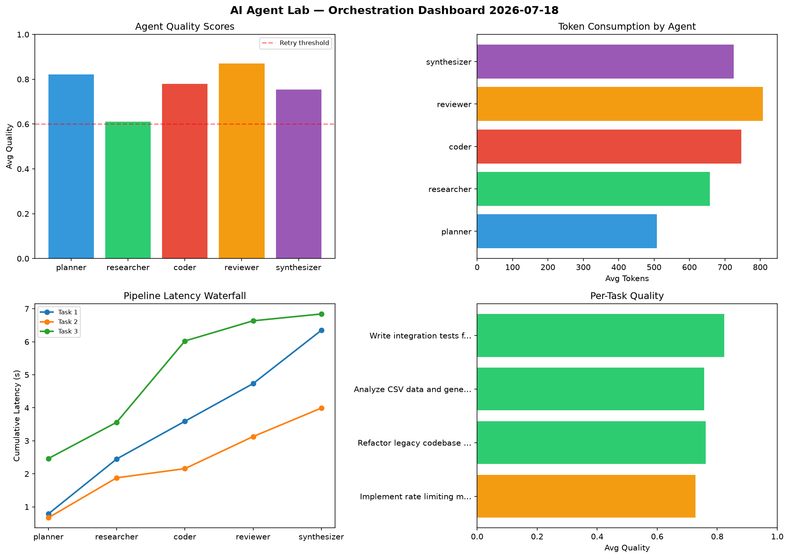

# AI Agent Lab — Orchestration Report 2026-07-18

**Run ID:** `95d9e388ff` | **Tasks:** 4 | **Avg Quality:** 0.767

## Aggregate Metrics

| Metric | Value |
|--------|-------|
| avg_latency | 6.068 |
| total_tokens | 13782 |
| avg_quality | 0.767 |

## Delta vs Yesterday

| Metric | Today | Yesterday | Change |
|--------|-------|-----------|--------|
| avg_latency | 6.068 | 5.569 | 📈 9.0% |
| total_tokens | 13782 | 13609 | 📈 1.3% |
| avg_quality | 0.767 | 0.779 | 📉 -1.5% |

## Pipeline Results

### Implement rate limiting middleware
| Agent | Quality | Latency | Tokens | Status |
|-------|---------|---------|--------|--------|
| planner | 0.727 | 0.788s | 562 | success |
| researcher | 0.562 | 1.661s | 927 | needs_retry |
| coder | 0.849 | 1.143s | 971 | success |
| reviewer | 0.694 | 1.141s | 736 | success |
| synthesizer | 0.806 | 1.614s | 420 | success |

### Refactor legacy codebase to use dependency injection
| Agent | Quality | Latency | Tokens | Status |
|-------|---------|---------|--------|--------|
| planner | 0.826 | 0.671s | 387 | success |
| researcher | 0.526 | 1.208s | 645 | needs_retry |
| coder | 0.968 | 0.278s | 427 | success |
| reviewer | 0.908 | 0.971s | 640 | success |
| synthesizer | 0.576 | 0.863s | 994 | needs_retry |

### Analyze CSV data and generate statistical summary
| Agent | Quality | Latency | Tokens | Status |
|-------|---------|---------|--------|--------|
| planner | 0.865 | 2.464s | 172 | success |
| researcher | 0.709 | 1.097s | 861 | success |
| coder | 0.568 | 2.462s | 991 | needs_retry |
| reviewer | 0.946 | 0.612s | 714 | success |
| synthesizer | 0.692 | 0.207s | 785 | success |

### Write integration tests for payment processing module
| Agent | Quality | Latency | Tokens | Status |
|-------|---------|---------|--------|--------|
| planner | 0.865 | 0.285s | 909 | success |
| researcher | 0.648 | 2.244s | 199 | success |
| coder | 0.73 | 2.08s | 598 | success |
| reviewer | 0.932 | 0.131s | 1141 | success |
| synthesizer | 0.941 | 2.352s | 703 | success |
