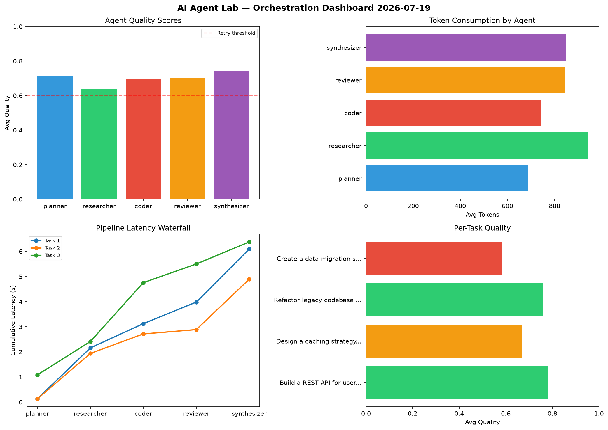

# AI Agent Lab — Orchestration Report 2026-07-19

**Run ID:** `a308df3263` | **Tasks:** 4 | **Avg Quality:** 0.699

## Aggregate Metrics

| Metric | Value |
|--------|-------|
| avg_latency | 5.63 |
| total_tokens | 16255 |
| avg_quality | 0.699 |

## Delta vs Yesterday

| Metric | Today | Yesterday | Change |
|--------|-------|-----------|--------|
| avg_latency | 5.63 | 6.396 | 📉 -12.0% |
| total_tokens | 16255 | 16337 | 📉 -0.5% |
| avg_quality | 0.699 | 0.725 | 📉 -3.6% |

## Pipeline Results

### Build a REST API for user authentication
| Agent | Quality | Latency | Tokens | Status |
|-------|---------|---------|--------|--------|
| planner | 0.755 | 0.133s | 633 | success |
| researcher | 0.805 | 2.026s | 559 | success |
| coder | 0.929 | 0.966s | 931 | success |
| reviewer | 0.721 | 0.857s | 468 | success |
| synthesizer | 0.696 | 2.115s | 1124 | success |

### Design a caching strategy for high-traffic endpoints
| Agent | Quality | Latency | Tokens | Status |
|-------|---------|---------|--------|--------|
| planner | 0.787 | 0.127s | 491 | success |
| researcher | 0.622 | 1.811s | 883 | success |
| coder | 0.529 | 0.778s | 673 | needs_retry |
| reviewer | 0.618 | 0.172s | 980 | success |
| synthesizer | 0.792 | 2.006s | 972 | success |

### Refactor legacy codebase to use dependency injection
| Agent | Quality | Latency | Tokens | Status |
|-------|---------|---------|--------|--------|
| planner | 0.761 | 1.085s | 465 | success |
| researcher | 0.548 | 1.328s | 1146 | needs_retry |
| coder | 0.714 | 2.344s | 653 | success |
| reviewer | 0.876 | 0.743s | 1166 | success |
| synthesizer | 0.904 | 0.879s | 453 | success |

### Create a data migration script for schema v2
| Agent | Quality | Latency | Tokens | Status |
|-------|---------|---------|--------|--------|
| planner | 0.557 | 0.877s | 1162 | needs_retry |
| researcher | 0.569 | 1.043s | 1177 | needs_retry |
| coder | 0.616 | 1.739s | 712 | success |
| reviewer | 0.593 | 0.153s | 757 | needs_retry |
| synthesizer | 0.586 | 1.339s | 850 | needs_retry |
