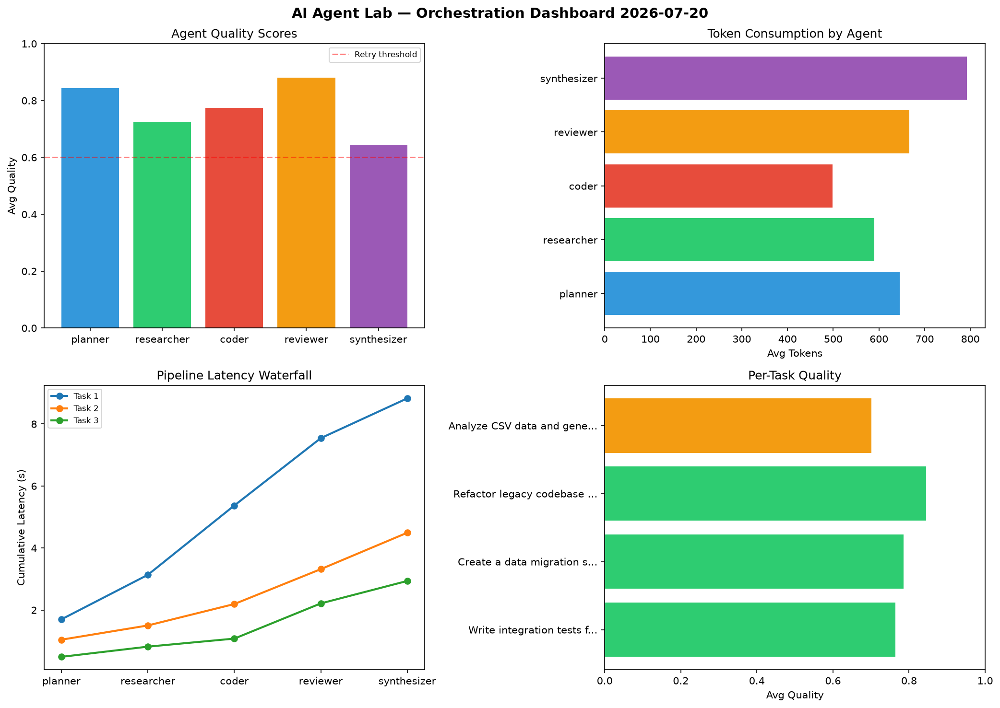

# AI Agent Lab — Orchestration Report 2026-07-20

**Run ID:** `e39f9ee46a` | **Tasks:** 4 | **Avg Quality:** 0.774

## Aggregate Metrics

| Metric | Value |
|--------|-------|
| avg_latency | 6.005 |
| total_tokens | 12774 |
| avg_quality | 0.774 |

## Delta vs Yesterday

| Metric | Today | Yesterday | Change |
|--------|-------|-----------|--------|
| avg_latency | 6.005 | 6.513 | 📉 -7.8% |
| total_tokens | 12774 | 13892 | 📉 -8.0% |
| avg_quality | 0.774 | 0.781 | 📉 -0.9% |

## Pipeline Results

### Write integration tests for payment processing module
| Agent | Quality | Latency | Tokens | Status |
|-------|---------|---------|--------|--------|
| planner | 0.912 | 1.7s | 903 | success |
| researcher | 0.814 | 1.436s | 657 | success |
| coder | 0.571 | 2.235s | 498 | needs_retry |
| reviewer | 0.752 | 2.172s | 717 | success |
| synthesizer | 0.773 | 1.283s | 816 | success |

### Create a data migration script for schema v2
| Agent | Quality | Latency | Tokens | Status |
|-------|---------|---------|--------|--------|
| planner | 0.784 | 1.044s | 642 | success |
| researcher | 0.655 | 0.459s | 319 | success |
| coder | 0.888 | 0.691s | 334 | success |
| reviewer | 0.884 | 1.125s | 746 | success |
| synthesizer | 0.715 | 1.174s | 1226 | success |

### Refactor legacy codebase to use dependency injection
| Agent | Quality | Latency | Tokens | Status |
|-------|---------|---------|--------|--------|
| planner | 0.962 | 0.491s | 358 | success |
| researcher | 0.89 | 0.329s | 644 | success |
| coder | 0.838 | 0.259s | 271 | success |
| reviewer | 0.967 | 1.135s | 439 | success |
| synthesizer | 0.567 | 0.724s | 219 | needs_retry |

### Analyze CSV data and generate statistical summary
| Agent | Quality | Latency | Tokens | Status |
|-------|---------|---------|--------|--------|
| planner | 0.718 | 1.337s | 680 | success |
| researcher | 0.545 | 0.587s | 740 | needs_retry |
| coder | 0.8 | 2.03s | 892 | success |
| reviewer | 0.919 | 2.305s | 763 | success |
| synthesizer | 0.525 | 1.503s | 910 | needs_retry |
