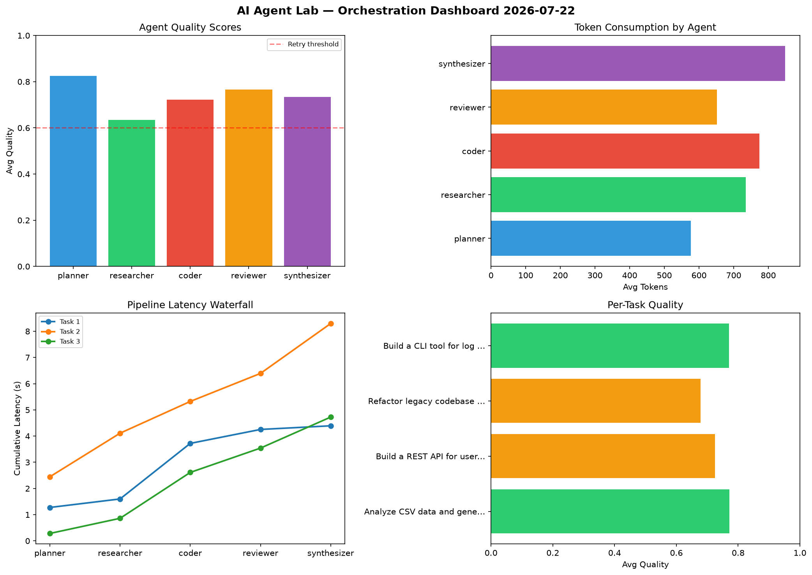

# AI Agent Lab — Orchestration Report 2026-07-22

**Run ID:** `ef3f2fb250` | **Tasks:** 4 | **Avg Quality:** 0.736

## Aggregate Metrics

| Metric | Value |
|--------|-------|
| avg_latency | 7.023 |
| total_tokens | 14347 |
| avg_quality | 0.736 |

## Delta vs Yesterday

| Metric | Today | Yesterday | Change |
|--------|-------|-----------|--------|
| avg_latency | 7.023 | 6.188 | 📈 13.5% |
| total_tokens | 14347 | 14320 | 📈 0.2% |
| avg_quality | 0.736 | 0.739 | 📉 -0.4% |

## Pipeline Results

### Analyze CSV data and generate statistical summary
| Agent | Quality | Latency | Tokens | Status |
|-------|---------|---------|--------|--------|
| planner | 0.684 | 1.275s | 863 | success |
| researcher | 0.59 | 0.325s | 694 | needs_retry |
| coder | 0.933 | 2.121s | 740 | success |
| reviewer | 0.904 | 0.532s | 654 | success |
| synthesizer | 0.748 | 0.139s | 536 | success |

### Build a REST API for user authentication
| Agent | Quality | Latency | Tokens | Status |
|-------|---------|---------|--------|--------|
| planner | 0.842 | 2.446s | 483 | success |
| researcher | 0.503 | 1.664s | 628 | needs_retry |
| coder | 0.548 | 1.212s | 833 | needs_retry |
| reviewer | 0.768 | 1.07s | 585 | success |
| synthesizer | 0.962 | 1.904s | 1168 | success |

### Refactor legacy codebase to use dependency injection
| Agent | Quality | Latency | Tokens | Status |
|-------|---------|---------|--------|--------|
| planner | 0.992 | 0.283s | 443 | success |
| researcher | 0.654 | 0.578s | 798 | success |
| coder | 0.536 | 1.752s | 882 | needs_retry |
| reviewer | 0.627 | 0.928s | 768 | success |
| synthesizer | 0.583 | 1.184s | 998 | needs_retry |

### Build a CLI tool for log analysis
| Agent | Quality | Latency | Tokens | Status |
|-------|---------|---------|--------|--------|
| planner | 0.783 | 2.131s | 519 | success |
| researcher | 0.788 | 2.213s | 822 | success |
| coder | 0.873 | 2.381s | 641 | success |
| reviewer | 0.765 | 1.513s | 599 | success |
| synthesizer | 0.641 | 2.44s | 693 | success |
