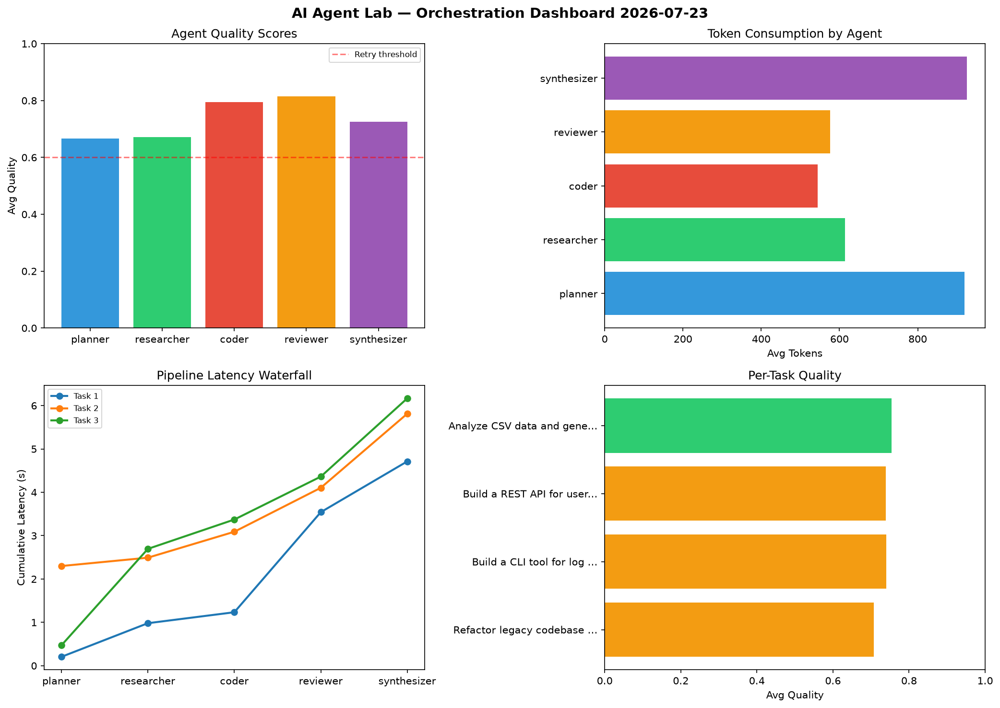

# AI Agent Lab — Orchestration Report 2026-07-23

**Run ID:** `be6c3a4bcb` | **Tasks:** 4 | **Avg Quality:** 0.735

## Aggregate Metrics

| Metric | Value |
|--------|-------|
| avg_latency | 6.021 |
| total_tokens | 14321 |
| avg_quality | 0.735 |

## Delta vs Yesterday

| Metric | Today | Yesterday | Change |
|--------|-------|-----------|--------|
| avg_latency | 6.021 | 7.023 | 📉 -14.3% |
| total_tokens | 14321 | 14347 | 📉 -0.2% |
| avg_quality | 0.735 | 0.736 | 📉 -0.1% |

## Pipeline Results

### Refactor legacy codebase to use dependency injection
| Agent | Quality | Latency | Tokens | Status |
|-------|---------|---------|--------|--------|
| planner | 0.615 | 0.205s | 1043 | success |
| researcher | 0.565 | 0.776s | 675 | needs_retry |
| coder | 0.71 | 0.253s | 492 | success |
| reviewer | 0.737 | 2.308s | 643 | success |
| synthesizer | 0.907 | 1.171s | 894 | success |

### Build a CLI tool for log analysis
| Agent | Quality | Latency | Tokens | Status |
|-------|---------|---------|--------|--------|
| planner | 0.687 | 2.3s | 834 | success |
| researcher | 0.591 | 0.192s | 887 | needs_retry |
| coder | 0.991 | 0.598s | 611 | success |
| reviewer | 0.915 | 1.014s | 531 | success |
| synthesizer | 0.514 | 1.709s | 1102 | needs_retry |

### Build a REST API for user authentication
| Agent | Quality | Latency | Tokens | Status |
|-------|---------|---------|--------|--------|
| planner | 0.527 | 0.47s | 804 | needs_retry |
| researcher | 0.68 | 2.225s | 505 | success |
| coder | 0.757 | 0.677s | 519 | success |
| reviewer | 0.963 | 0.99s | 796 | success |
| synthesizer | 0.767 | 1.805s | 757 | success |

### Analyze CSV data and generate statistical summary
| Agent | Quality | Latency | Tokens | Status |
|-------|---------|---------|--------|--------|
| planner | 0.84 | 0.333s | 998 | success |
| researcher | 0.851 | 2.325s | 389 | success |
| coder | 0.72 | 0.776s | 556 | success |
| reviewer | 0.642 | 1.7s | 334 | success |
| synthesizer | 0.715 | 2.259s | 951 | success |
