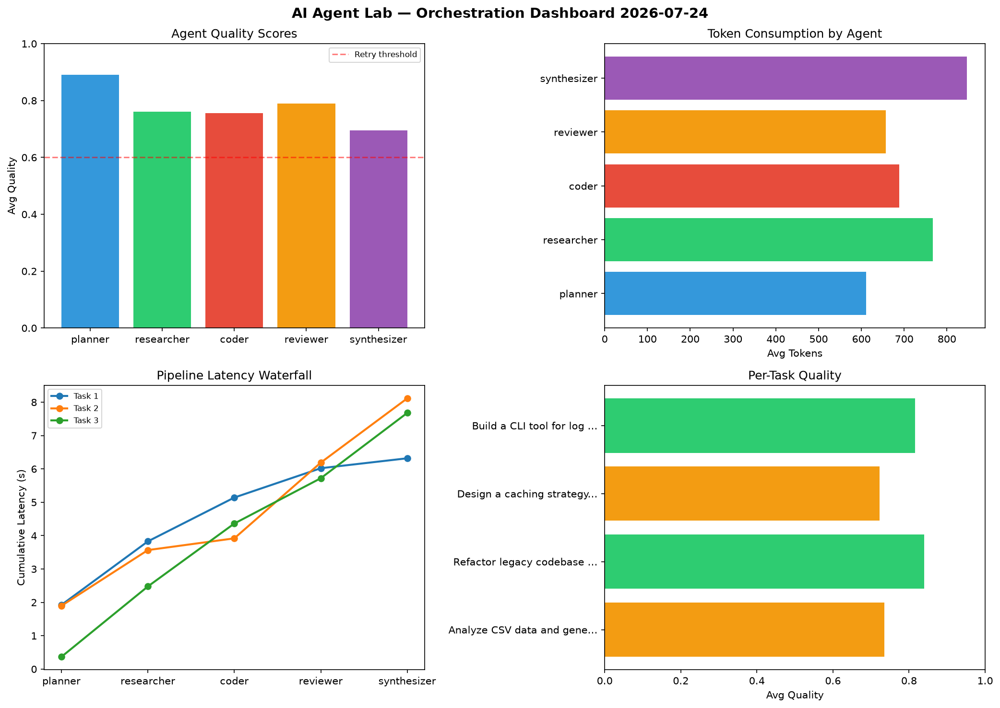

# AI Agent Lab — Orchestration Report 2026-07-24

**Run ID:** `fba303049b` | **Tasks:** 4 | **Avg Quality:** 0.778

## Aggregate Metrics

| Metric | Value |
|--------|-------|
| avg_latency | 7.003 |
| total_tokens | 14285 |
| avg_quality | 0.778 |

## Delta vs Yesterday

| Metric | Today | Yesterday | Change |
|--------|-------|-----------|--------|
| avg_latency | 7.003 | 6.021 | 📈 16.3% |
| total_tokens | 14285 | 14321 | 📉 -0.3% |
| avg_quality | 0.778 | 0.735 | 📈 5.9% |

## Pipeline Results

### Analyze CSV data and generate statistical summary
| Agent | Quality | Latency | Tokens | Status |
|-------|---------|---------|--------|--------|
| planner | 0.876 | 1.923s | 589 | success |
| researcher | 0.692 | 1.905s | 525 | success |
| coder | 0.678 | 1.314s | 671 | success |
| reviewer | 0.873 | 0.879s | 472 | success |
| synthesizer | 0.558 | 0.298s | 812 | needs_retry |

### Refactor legacy codebase to use dependency injection
| Agent | Quality | Latency | Tokens | Status |
|-------|---------|---------|--------|--------|
| planner | 0.893 | 1.897s | 489 | success |
| researcher | 0.536 | 1.67s | 979 | needs_retry |
| coder | 0.944 | 0.352s | 764 | success |
| reviewer | 0.894 | 2.27s | 493 | success |
| synthesizer | 0.933 | 1.926s | 1084 | success |

### Design a caching strategy for high-traffic endpoints
| Agent | Quality | Latency | Tokens | Status |
|-------|---------|---------|--------|--------|
| planner | 0.8 | 0.367s | 591 | success |
| researcher | 0.84 | 2.11s | 859 | success |
| coder | 0.843 | 1.886s | 860 | success |
| reviewer | 0.538 | 1.358s | 725 | needs_retry |
| synthesizer | 0.59 | 1.958s | 901 | needs_retry |

### Build a CLI tool for log analysis
| Agent | Quality | Latency | Tokens | Status |
|-------|---------|---------|--------|--------|
| planner | 0.994 | 1.639s | 775 | success |
| researcher | 0.975 | 1.569s | 707 | success |
| coder | 0.561 | 0.492s | 459 | needs_retry |
| reviewer | 0.851 | 0.873s | 939 | success |
| synthesizer | 0.7 | 1.327s | 591 | success |
