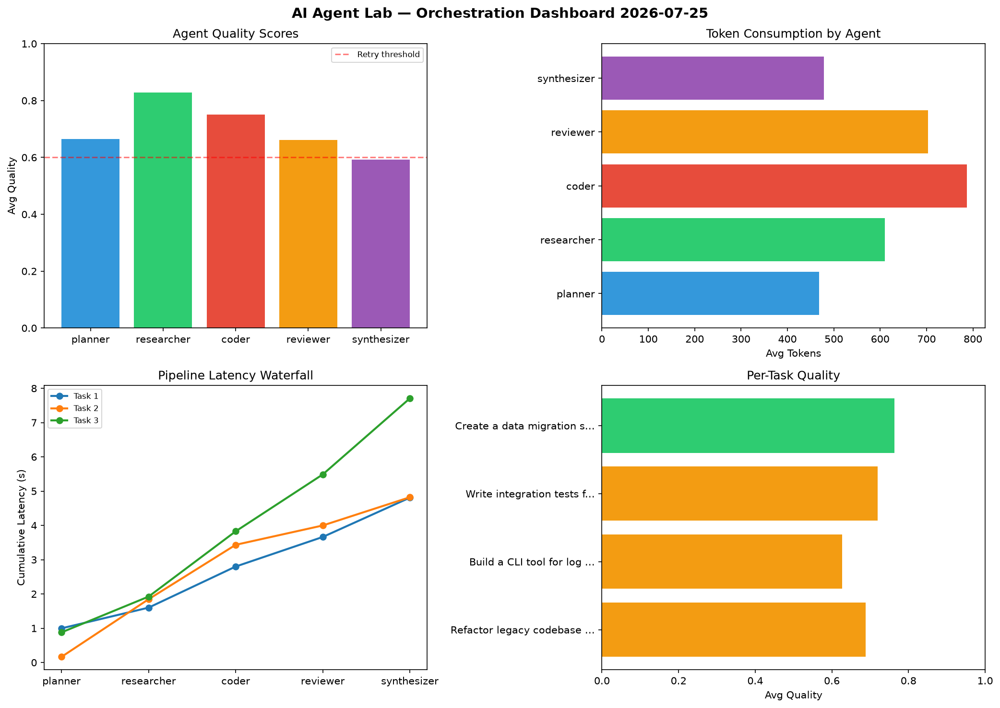

# AI Agent Lab — Orchestration Report 2026-07-25

**Run ID:** `42c92e2c72` | **Tasks:** 4 | **Avg Quality:** 0.7

## Aggregate Metrics

| Metric | Value |
|--------|-------|
| avg_latency | 5.957 |
| total_tokens | 12189 |
| avg_quality | 0.7 |

## Delta vs Yesterday

| Metric | Today | Yesterday | Change |
|--------|-------|-----------|--------|
| avg_latency | 5.957 | 7.003 | 📉 -14.9% |
| total_tokens | 12189 | 14285 | 📉 -14.7% |
| avg_quality | 0.7 | 0.778 | 📉 -10.0% |

## Pipeline Results

### Refactor legacy codebase to use dependency injection
| Agent | Quality | Latency | Tokens | Status |
|-------|---------|---------|--------|--------|
| planner | 0.572 | 0.997s | 703 | needs_retry |
| researcher | 0.789 | 0.604s | 479 | success |
| coder | 0.874 | 1.199s | 523 | success |
| reviewer | 0.639 | 0.863s | 909 | success |
| synthesizer | 0.564 | 1.147s | 374 | needs_retry |

### Build a CLI tool for log analysis
| Agent | Quality | Latency | Tokens | Status |
|-------|---------|---------|--------|--------|
| planner | 0.567 | 0.165s | 302 | needs_retry |
| researcher | 0.72 | 1.682s | 624 | success |
| coder | 0.639 | 1.587s | 879 | success |
| reviewer | 0.684 | 0.564s | 271 | success |
| synthesizer | 0.524 | 0.824s | 501 | needs_retry |

### Write integration tests for payment processing module
| Agent | Quality | Latency | Tokens | Status |
|-------|---------|---------|--------|--------|
| planner | 0.87 | 0.879s | 555 | success |
| researcher | 0.944 | 1.044s | 823 | success |
| coder | 0.674 | 1.905s | 852 | success |
| reviewer | 0.507 | 1.66s | 717 | needs_retry |
| synthesizer | 0.604 | 2.219s | 697 | success |

### Create a data migration script for schema v2
| Agent | Quality | Latency | Tokens | Status |
|-------|---------|---------|--------|--------|
| planner | 0.649 | 1.298s | 314 | success |
| researcher | 0.861 | 1.904s | 515 | success |
| coder | 0.815 | 0.212s | 894 | success |
| reviewer | 0.813 | 1.268s | 916 | success |
| synthesizer | 0.678 | 1.806s | 341 | success |
