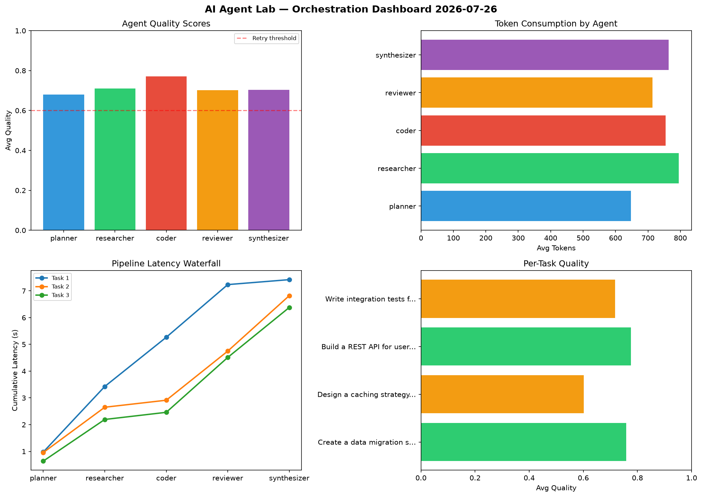

# AI Agent Lab — Orchestration Report 2026-07-26

**Run ID:** `fc0cbba11e` | **Tasks:** 4 | **Avg Quality:** 0.713

## Aggregate Metrics

| Metric | Value |
|--------|-------|
| avg_latency | 7.509 |
| total_tokens | 14696 |
| avg_quality | 0.713 |

## Delta vs Yesterday

| Metric | Today | Yesterday | Change |
|--------|-------|-----------|--------|
| avg_latency | 7.509 | 6.953 | 📈 8.0% |
| total_tokens | 14696 | 13695 | 📈 7.3% |
| avg_quality | 0.713 | 0.71 | 📈 0.4% |

## Pipeline Results

### Create a data migration script for schema v2
| Agent | Quality | Latency | Tokens | Status |
|-------|---------|---------|--------|--------|
| planner | 0.594 | 0.976s | 484 | needs_retry |
| researcher | 0.848 | 2.451s | 793 | success |
| coder | 0.983 | 1.839s | 490 | success |
| reviewer | 0.761 | 1.969s | 373 | success |
| synthesizer | 0.603 | 0.185s | 1016 | success |

### Design a caching strategy for high-traffic endpoints
| Agent | Quality | Latency | Tokens | Status |
|-------|---------|---------|--------|--------|
| planner | 0.77 | 0.957s | 901 | success |
| researcher | 0.53 | 1.694s | 522 | needs_retry |
| coder | 0.594 | 0.262s | 916 | needs_retry |
| reviewer | 0.523 | 1.836s | 1012 | needs_retry |
| synthesizer | 0.593 | 2.072s | 636 | needs_retry |

### Build a REST API for user authentication
| Agent | Quality | Latency | Tokens | Status |
|-------|---------|---------|--------|--------|
| planner | 0.747 | 0.638s | 429 | success |
| researcher | 0.741 | 1.556s | 951 | success |
| coder | 0.785 | 0.267s | 1036 | success |
| reviewer | 0.703 | 2.052s | 718 | success |
| synthesizer | 0.904 | 1.867s | 903 | success |

### Write integration tests for payment processing module
| Agent | Quality | Latency | Tokens | Status |
|-------|---------|---------|--------|--------|
| planner | 0.611 | 1.74s | 776 | success |
| researcher | 0.722 | 2.484s | 913 | success |
| coder | 0.719 | 1.873s | 575 | success |
| reviewer | 0.818 | 0.995s | 752 | success |
| synthesizer | 0.714 | 2.323s | 500 | success |
