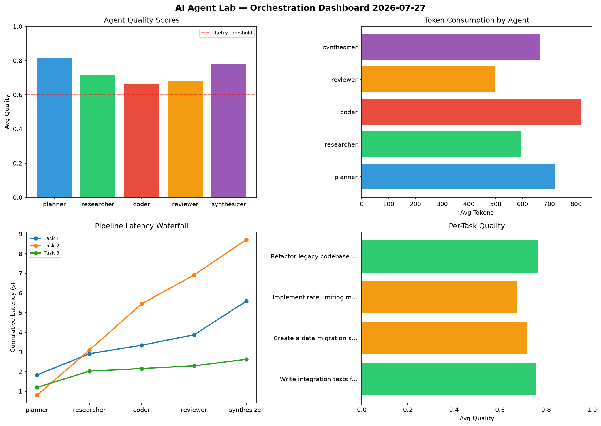

# AI Agent Lab — Orchestration Report 2026-07-27

**Run ID:** `44da8bcbb5` | **Tasks:** 4 | **Avg Quality:** 0.729

## Aggregate Metrics

| Metric | Value |
|--------|-------|
| avg_latency | 6.644 |
| total_tokens | 13192 |
| avg_quality | 0.729 |

## Delta vs Yesterday

| Metric | Today | Yesterday | Change |
|--------|-------|-----------|--------|
| avg_latency | 6.644 | 5.703 | 📈 16.5% |
| total_tokens | 13192 | 11672 | 📈 13.0% |
| avg_quality | 0.729 | 0.722 | 📈 1.0% |

## Pipeline Results

### Write integration tests for payment processing module
| Agent | Quality | Latency | Tokens | Status |
|-------|---------|---------|--------|--------|
| planner | 0.837 | 1.832s | 1193 | success |
| researcher | 0.857 | 1.078s | 730 | success |
| coder | 0.579 | 0.436s | 810 | needs_retry |
| reviewer | 0.69 | 0.524s | 298 | success |
| synthesizer | 0.828 | 1.711s | 776 | success |

### Create a data migration script for schema v2
| Agent | Quality | Latency | Tokens | Status |
|-------|---------|---------|--------|--------|
| planner | 0.558 | 0.802s | 542 | needs_retry |
| researcher | 0.505 | 2.289s | 643 | needs_retry |
| coder | 0.985 | 2.361s | 851 | success |
| reviewer | 0.693 | 1.458s | 866 | success |
| synthesizer | 0.853 | 1.8s | 444 | success |

### Implement rate limiting middleware
| Agent | Quality | Latency | Tokens | Status |
|-------|---------|---------|--------|--------|
| planner | 0.9 | 1.201s | 729 | success |
| researcher | 0.702 | 0.825s | 523 | success |
| coder | 0.53 | 0.131s | 1179 | needs_retry |
| reviewer | 0.565 | 0.14s | 544 | needs_retry |
| synthesizer | 0.674 | 0.331s | 621 | success |

### Refactor legacy codebase to use dependency injection
| Agent | Quality | Latency | Tokens | Status |
|-------|---------|---------|--------|--------|
| planner | 0.956 | 0.871s | 426 | success |
| researcher | 0.79 | 2.467s | 477 | success |
| coder | 0.562 | 2.233s | 436 | needs_retry |
| reviewer | 0.775 | 2.318s | 279 | success |
| synthesizer | 0.753 | 1.767s | 825 | success |
