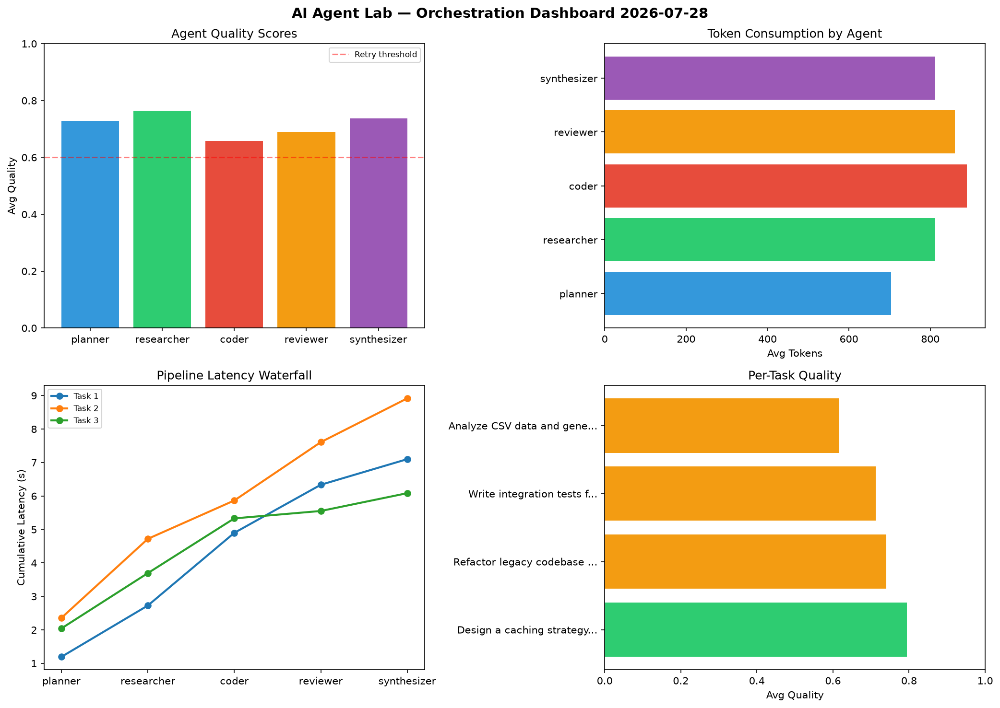

# AI Agent Lab — Orchestration Report 2026-07-28

**Run ID:** `f8b208c57b` | **Tasks:** 4 | **Avg Quality:** 0.716

## Aggregate Metrics

| Metric | Value |
|--------|-------|
| avg_latency | 7.432 |
| total_tokens | 16313 |
| avg_quality | 0.716 |

## Delta vs Yesterday

| Metric | Today | Yesterday | Change |
|--------|-------|-----------|--------|
| avg_latency | 7.432 | 7.502 | 📉 -0.9% |
| total_tokens | 16313 | 14771 | 📈 10.4% |
| avg_quality | 0.716 | 0.741 | 📉 -3.4% |

## Pipeline Results

### Design a caching strategy for high-traffic endpoints
| Agent | Quality | Latency | Tokens | Status |
|-------|---------|---------|--------|--------|
| planner | 0.956 | 1.196s | 516 | success |
| researcher | 0.957 | 1.533s | 1018 | success |
| coder | 0.715 | 2.171s | 676 | success |
| reviewer | 0.806 | 1.436s | 770 | success |
| synthesizer | 0.534 | 0.765s | 1043 | needs_retry |

### Refactor legacy codebase to use dependency injection
| Agent | Quality | Latency | Tokens | Status |
|-------|---------|---------|--------|--------|
| planner | 0.528 | 2.359s | 854 | needs_retry |
| researcher | 0.837 | 2.362s | 784 | success |
| coder | 0.561 | 1.146s | 885 | needs_retry |
| reviewer | 0.859 | 1.742s | 894 | success |
| synthesizer | 0.916 | 1.308s | 1236 | success |

### Write integration tests for payment processing module
| Agent | Quality | Latency | Tokens | Status |
|-------|---------|---------|--------|--------|
| planner | 0.924 | 2.045s | 910 | success |
| researcher | 0.527 | 1.652s | 1023 | needs_retry |
| coder | 0.853 | 1.635s | 929 | success |
| reviewer | 0.594 | 0.221s | 842 | needs_retry |
| synthesizer | 0.662 | 0.532s | 387 | success |

### Analyze CSV data and generate statistical summary
| Agent | Quality | Latency | Tokens | Status |
|-------|---------|---------|--------|--------|
| planner | 0.506 | 1.987s | 535 | needs_retry |
| researcher | 0.733 | 0.831s | 425 | success |
| coder | 0.502 | 2.307s | 1071 | needs_retry |
| reviewer | 0.503 | 1.439s | 938 | needs_retry |
| synthesizer | 0.838 | 1.059s | 577 | success |
