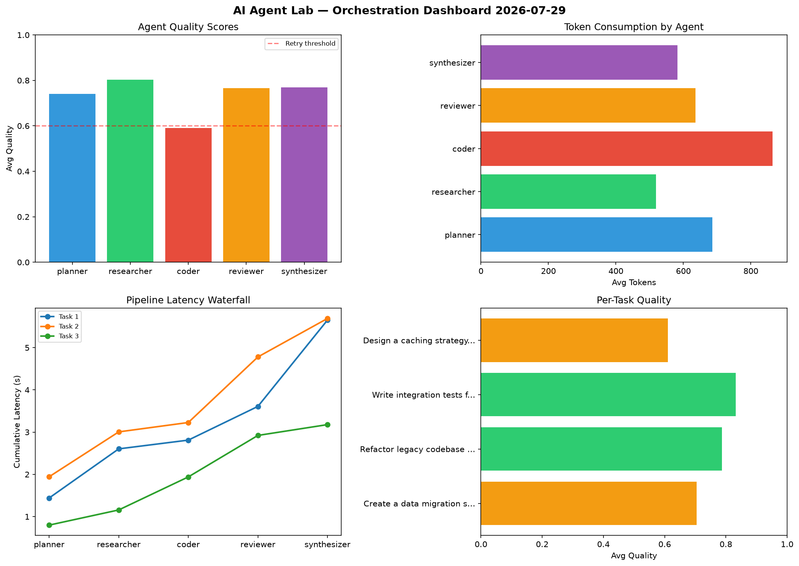

# AI Agent Lab — Orchestration Report 2026-07-29

**Run ID:** `ae9647cb14` | **Tasks:** 4 | **Avg Quality:** 0.734

## Aggregate Metrics

| Metric | Value |
|--------|-------|
| avg_latency | 4.853 |
| total_tokens | 13151 |
| avg_quality | 0.734 |

## Delta vs Yesterday

| Metric | Today | Yesterday | Change |
|--------|-------|-----------|--------|
| avg_latency | 4.853 | 7.432 | 📉 -34.7% |
| total_tokens | 13151 | 16313 | 📉 -19.4% |
| avg_quality | 0.734 | 0.716 | 📈 2.5% |

## Pipeline Results

### Create a data migration script for schema v2
| Agent | Quality | Latency | Tokens | Status |
|-------|---------|---------|--------|--------|
| planner | 0.715 | 1.441s | 819 | success |
| researcher | 0.578 | 1.163s | 622 | needs_retry |
| coder | 0.607 | 0.207s | 807 | success |
| reviewer | 0.748 | 0.798s | 565 | success |
| synthesizer | 0.872 | 2.044s | 316 | success |

### Refactor legacy codebase to use dependency injection
| Agent | Quality | Latency | Tokens | Status |
|-------|---------|---------|--------|--------|
| planner | 0.785 | 1.944s | 608 | success |
| researcher | 0.977 | 1.062s | 459 | success |
| coder | 0.63 | 0.222s | 1051 | success |
| reviewer | 0.706 | 1.552s | 725 | success |
| synthesizer | 0.837 | 0.911s | 903 | success |

### Write integration tests for payment processing module
| Agent | Quality | Latency | Tokens | Status |
|-------|---------|---------|--------|--------|
| planner | 0.921 | 0.799s | 577 | success |
| researcher | 0.992 | 0.359s | 461 | success |
| coder | 0.616 | 0.782s | 503 | success |
| reviewer | 0.874 | 0.982s | 786 | success |
| synthesizer | 0.756 | 0.256s | 728 | success |

### Design a caching strategy for high-traffic endpoints
| Agent | Quality | Latency | Tokens | Status |
|-------|---------|---------|--------|--------|
| planner | 0.541 | 0.202s | 739 | needs_retry |
| researcher | 0.662 | 0.689s | 535 | success |
| coder | 0.508 | 2.114s | 1096 | needs_retry |
| reviewer | 0.734 | 0.703s | 469 | success |
| synthesizer | 0.611 | 1.182s | 382 | success |
