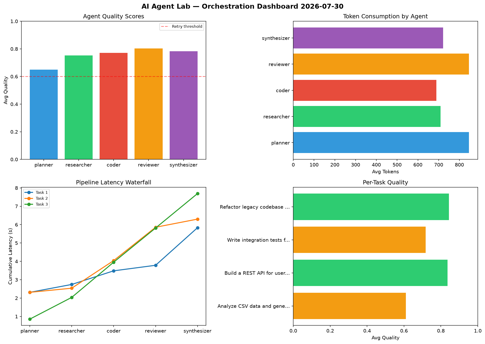

# AI Agent Lab — Orchestration Report 2026-07-30

**Run ID:** `6103cba7c8` | **Tasks:** 4 | **Avg Quality:** 0.752

## Aggregate Metrics

| Metric | Value |
|--------|-------|
| avg_latency | 6.179 |
| total_tokens | 15248 |
| avg_quality | 0.752 |

## Delta vs Yesterday

| Metric | Today | Yesterday | Change |
|--------|-------|-----------|--------|
| avg_latency | 6.179 | 5.769 | 📈 7.1% |
| total_tokens | 15248 | 14730 | 📈 3.5% |
| avg_quality | 0.752 | 0.693 | 📈 8.5% |

## Pipeline Results

### Analyze CSV data and generate statistical summary
| Agent | Quality | Latency | Tokens | Status |
|-------|---------|---------|--------|--------|
| planner | 0.552 | 2.312s | 513 | needs_retry |
| researcher | 0.623 | 0.43s | 787 | success |
| coder | 0.6 | 0.742s | 405 | needs_retry |
| reviewer | 0.736 | 0.302s | 482 | success |
| synthesizer | 0.538 | 2.047s | 563 | needs_retry |

### Build a REST API for user authentication
| Agent | Quality | Latency | Tokens | Status |
|-------|---------|---------|--------|--------|
| planner | 0.843 | 2.313s | 1003 | success |
| researcher | 0.691 | 0.225s | 498 | success |
| coder | 0.964 | 1.503s | 690 | success |
| reviewer | 0.898 | 1.816s | 1002 | success |
| synthesizer | 0.783 | 0.443s | 1106 | success |

### Write integration tests for payment processing module
| Agent | Quality | Latency | Tokens | Status |
|-------|---------|---------|--------|--------|
| planner | 0.546 | 0.853s | 1121 | needs_retry |
| researcher | 0.729 | 1.185s | 624 | success |
| coder | 0.765 | 1.916s | 806 | success |
| reviewer | 0.69 | 1.862s | 1018 | success |
| synthesizer | 0.861 | 1.876s | 822 | success |

### Refactor legacy codebase to use dependency injection
| Agent | Quality | Latency | Tokens | Status |
|-------|---------|---------|--------|--------|
| planner | 0.655 | 0.965s | 745 | success |
| researcher | 0.967 | 1.288s | 929 | success |
| coder | 0.755 | 0.968s | 855 | success |
| reviewer | 0.891 | 0.263s | 883 | success |
| synthesizer | 0.951 | 1.407s | 396 | success |
