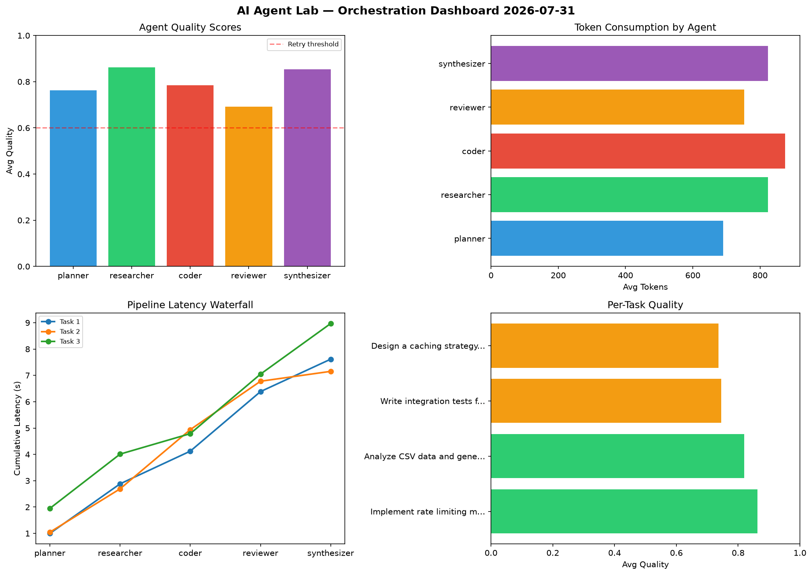

# AI Agent Lab — Orchestration Report 2026-07-31

**Run ID:** `65d36c0120` | **Tasks:** 4 | **Avg Quality:** 0.791

## Aggregate Metrics

| Metric | Value |
|--------|-------|
| avg_latency | 7.636 |
| total_tokens | 15855 |
| avg_quality | 0.791 |

## Delta vs Yesterday

| Metric | Today | Yesterday | Change |
|--------|-------|-----------|--------|
| avg_latency | 7.636 | 6.179 | 📈 23.6% |
| total_tokens | 15855 | 15248 | 📈 4.0% |
| avg_quality | 0.791 | 0.752 | 📈 5.2% |

## Pipeline Results

### Implement rate limiting middleware
| Agent | Quality | Latency | Tokens | Status |
|-------|---------|---------|--------|--------|
| planner | 0.95 | 0.997s | 581 | success |
| researcher | 0.85 | 1.884s | 1096 | success |
| coder | 0.844 | 1.241s | 869 | success |
| reviewer | 0.717 | 2.262s | 1011 | success |
| synthesizer | 0.953 | 1.231s | 938 | success |

### Analyze CSV data and generate statistical summary
| Agent | Quality | Latency | Tokens | Status |
|-------|---------|---------|--------|--------|
| planner | 0.923 | 1.045s | 954 | success |
| researcher | 0.981 | 1.646s | 852 | success |
| coder | 0.868 | 2.249s | 1086 | success |
| reviewer | 0.509 | 1.837s | 1166 | needs_retry |
| synthesizer | 0.812 | 0.376s | 1045 | success |

### Write integration tests for payment processing module
| Agent | Quality | Latency | Tokens | Status |
|-------|---------|---------|--------|--------|
| planner | 0.633 | 1.948s | 803 | success |
| researcher | 0.649 | 2.062s | 318 | success |
| coder | 0.726 | 0.777s | 753 | success |
| reviewer | 0.753 | 2.26s | 321 | success |
| synthesizer | 0.962 | 1.922s | 284 | success |

### Design a caching strategy for high-traffic endpoints
| Agent | Quality | Latency | Tokens | Status |
|-------|---------|---------|--------|--------|
| planner | 0.542 | 1.123s | 422 | needs_retry |
| researcher | 0.968 | 1.647s | 1026 | success |
| coder | 0.702 | 0.354s | 791 | success |
| reviewer | 0.785 | 1.202s | 512 | success |
| synthesizer | 0.687 | 2.481s | 1027 | success |
