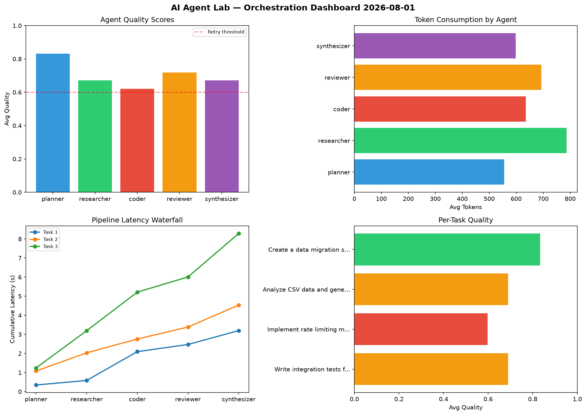

# AI Agent Lab — Orchestration Report 2026-08-01

**Run ID:** `2cc927f42e` | **Tasks:** 4 | **Avg Quality:** 0.703

## Aggregate Metrics

| Metric | Value |
|--------|-------|
| avg_latency | 6.188 |
| total_tokens | 13073 |
| avg_quality | 0.703 |

## Delta vs Yesterday

| Metric | Today | Yesterday | Change |
|--------|-------|-----------|--------|
| avg_latency | 6.188 | 5.343 | 📈 15.8% |
| total_tokens | 13073 | 13459 | 📉 -2.9% |
| avg_quality | 0.703 | 0.786 | 📉 -10.6% |

## Pipeline Results

### Write integration tests for payment processing module
| Agent | Quality | Latency | Tokens | Status |
|-------|---------|---------|--------|--------|
| planner | 0.852 | 0.346s | 295 | success |
| researcher | 0.63 | 0.239s | 806 | success |
| coder | 0.613 | 1.51s | 568 | success |
| reviewer | 0.664 | 0.373s | 1086 | success |
| synthesizer | 0.69 | 0.729s | 494 | success |

### Implement rate limiting middleware
| Agent | Quality | Latency | Tokens | Status |
|-------|---------|---------|--------|--------|
| planner | 0.706 | 1.079s | 678 | success |
| researcher | 0.501 | 0.954s | 620 | needs_retry |
| coder | 0.532 | 0.723s | 720 | needs_retry |
| reviewer | 0.728 | 0.628s | 550 | success |
| synthesizer | 0.524 | 1.149s | 649 | needs_retry |

### Analyze CSV data and generate statistical summary
| Agent | Quality | Latency | Tokens | Status |
|-------|---------|---------|--------|--------|
| planner | 0.914 | 1.238s | 452 | success |
| researcher | 0.58 | 1.952s | 890 | needs_retry |
| coder | 0.66 | 2.023s | 776 | success |
| reviewer | 0.628 | 0.795s | 658 | success |
| synthesizer | 0.669 | 2.277s | 462 | success |

### Create a data migration script for schema v2
| Agent | Quality | Latency | Tokens | Status |
|-------|---------|---------|--------|--------|
| planner | 0.858 | 2.043s | 795 | success |
| researcher | 0.975 | 0.429s | 832 | success |
| coder | 0.682 | 1.982s | 479 | success |
| reviewer | 0.857 | 2.38s | 477 | success |
| synthesizer | 0.8 | 1.902s | 786 | success |
