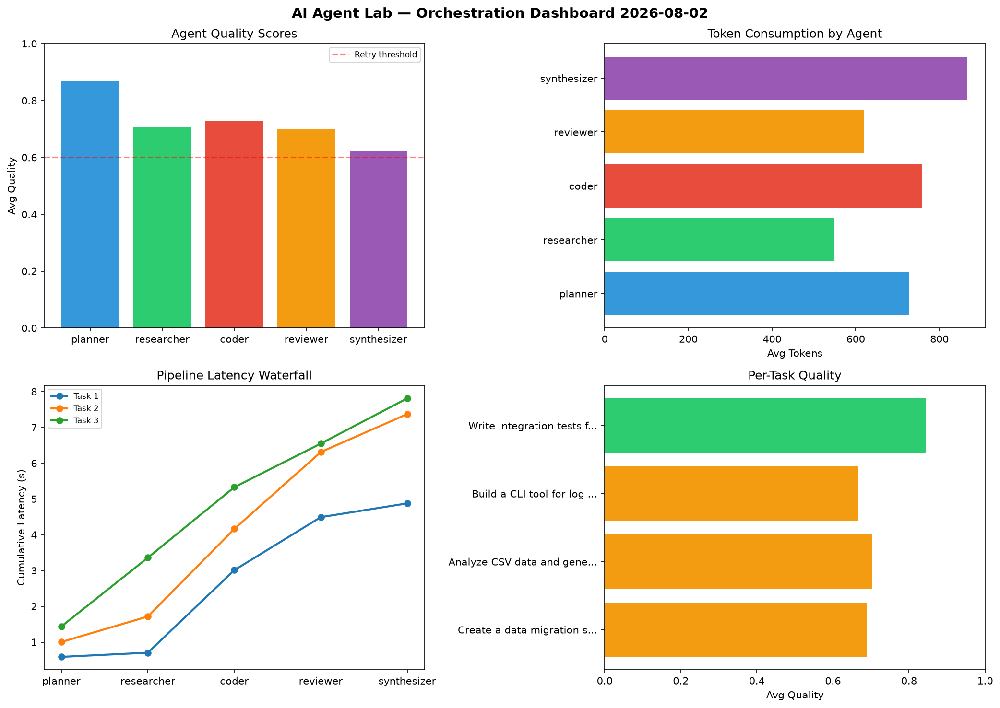

# AI Agent Lab — Orchestration Report 2026-08-02

**Run ID:** `a422a73441` | **Tasks:** 4 | **Avg Quality:** 0.725

## Aggregate Metrics

| Metric | Value |
|--------|-------|
| avg_latency | 6.166 |
| total_tokens | 14078 |
| avg_quality | 0.725 |

## Delta vs Yesterday

| Metric | Today | Yesterday | Change |
|--------|-------|-----------|--------|
| avg_latency | 6.166 | 6.188 | 📉 -0.4% |
| total_tokens | 14078 | 13073 | 📈 7.7% |
| avg_quality | 0.725 | 0.703 | 📈 3.1% |

## Pipeline Results

### Create a data migration script for schema v2
| Agent | Quality | Latency | Tokens | Status |
|-------|---------|---------|--------|--------|
| planner | 0.743 | 0.588s | 967 | success |
| researcher | 0.664 | 0.117s | 315 | success |
| coder | 0.662 | 2.305s | 1000 | success |
| reviewer | 0.597 | 1.482s | 726 | needs_retry |
| synthesizer | 0.78 | 0.384s | 769 | success |

### Analyze CSV data and generate statistical summary
| Agent | Quality | Latency | Tokens | Status |
|-------|---------|---------|--------|--------|
| planner | 0.953 | 1.003s | 687 | success |
| researcher | 0.668 | 0.714s | 299 | success |
| coder | 0.748 | 2.445s | 1008 | success |
| reviewer | 0.528 | 2.148s | 671 | needs_retry |
| synthesizer | 0.613 | 1.062s | 436 | success |

### Build a CLI tool for log analysis
| Agent | Quality | Latency | Tokens | Status |
|-------|---------|---------|--------|--------|
| planner | 0.908 | 1.439s | 787 | success |
| researcher | 0.588 | 1.92s | 575 | needs_retry |
| coder | 0.578 | 1.969s | 361 | needs_retry |
| reviewer | 0.751 | 1.219s | 899 | success |
| synthesizer | 0.512 | 1.264s | 1049 | needs_retry |

### Write integration tests for payment processing module
| Agent | Quality | Latency | Tokens | Status |
|-------|---------|---------|--------|--------|
| planner | 0.873 | 0.894s | 466 | success |
| researcher | 0.914 | 0.264s | 1003 | success |
| coder | 0.926 | 0.974s | 667 | success |
| reviewer | 0.922 | 0.147s | 183 | success |
| synthesizer | 0.584 | 2.327s | 1210 | needs_retry |
