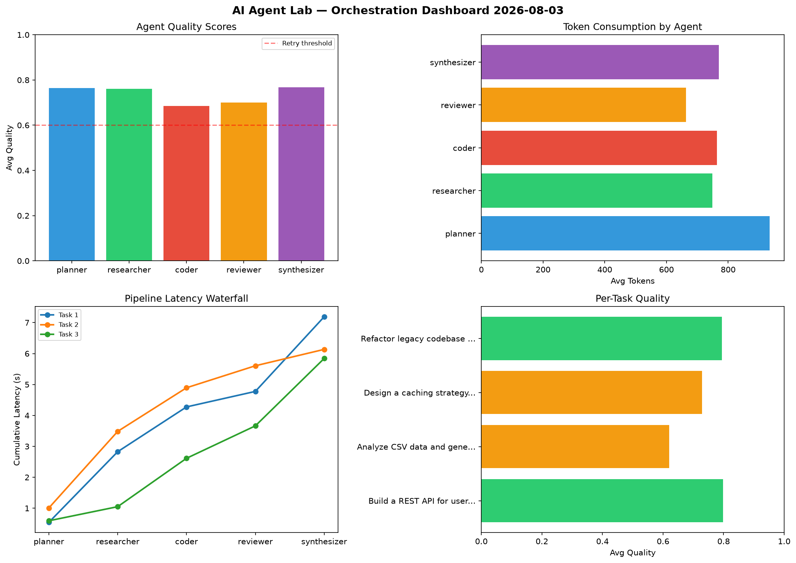

# AI Agent Lab — Orchestration Report 2026-08-03

**Run ID:** `fcda383c12` | **Tasks:** 4 | **Avg Quality:** 0.736

## Aggregate Metrics

| Metric | Value |
|--------|-------|
| avg_latency | 6.224 |
| total_tokens | 15525 |
| avg_quality | 0.736 |

## Delta vs Yesterday

| Metric | Today | Yesterday | Change |
|--------|-------|-----------|--------|
| avg_latency | 6.224 | 8.568 | 📉 -27.4% |
| total_tokens | 15525 | 14800 | 📈 4.9% |
| avg_quality | 0.736 | 0.776 | 📉 -5.2% |

## Pipeline Results

### Build a REST API for user authentication
| Agent | Quality | Latency | Tokens | Status |
|-------|---------|---------|--------|--------|
| planner | 0.834 | 0.544s | 757 | success |
| researcher | 0.927 | 2.283s | 659 | success |
| coder | 0.602 | 1.448s | 1005 | success |
| reviewer | 0.844 | 0.501s | 806 | success |
| synthesizer | 0.785 | 2.413s | 623 | success |

### Analyze CSV data and generate statistical summary
| Agent | Quality | Latency | Tokens | Status |
|-------|---------|---------|--------|--------|
| planner | 0.516 | 1.009s | 980 | needs_retry |
| researcher | 0.793 | 2.475s | 765 | success |
| coder | 0.673 | 1.41s | 565 | success |
| reviewer | 0.547 | 0.711s | 508 | needs_retry |
| synthesizer | 0.569 | 0.53s | 922 | needs_retry |

### Design a caching strategy for high-traffic endpoints
| Agent | Quality | Latency | Tokens | Status |
|-------|---------|---------|--------|--------|
| planner | 0.79 | 0.594s | 888 | success |
| researcher | 0.744 | 0.456s | 536 | success |
| coder | 0.607 | 1.564s | 419 | success |
| reviewer | 0.676 | 1.048s | 639 | success |
| synthesizer | 0.826 | 2.179s | 1000 | success |

### Refactor legacy codebase to use dependency injection
| Agent | Quality | Latency | Tokens | Status |
|-------|---------|---------|--------|--------|
| planner | 0.917 | 0.429s | 1114 | success |
| researcher | 0.579 | 1.257s | 1036 | needs_retry |
| coder | 0.855 | 2.284s | 1065 | success |
| reviewer | 0.733 | 1.606s | 702 | success |
| synthesizer | 0.892 | 0.157s | 536 | success |
