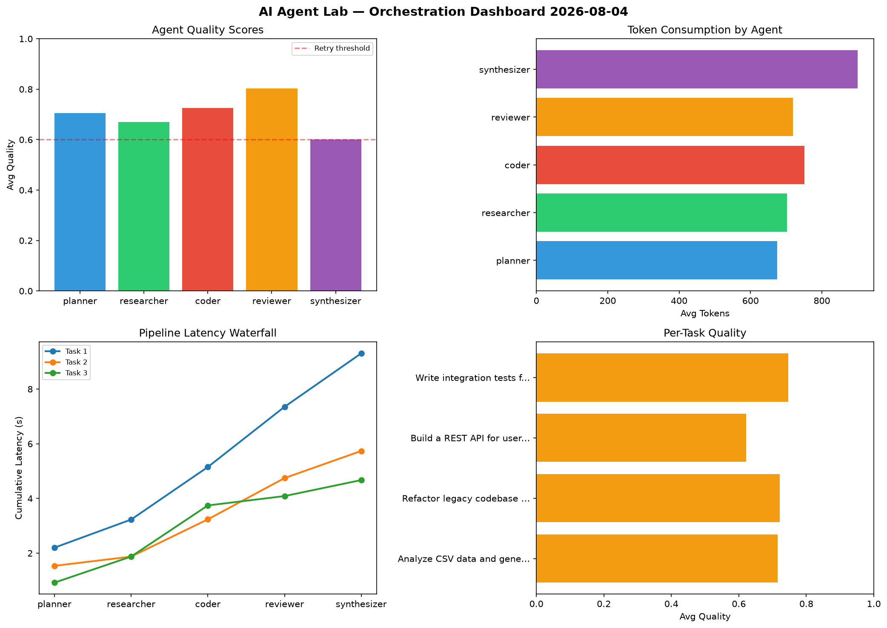

# AI Agent Lab — Orchestration Report 2026-08-04

**Run ID:** `066ffd72e5` | **Tasks:** 4 | **Avg Quality:** 0.701

## Aggregate Metrics

| Metric | Value |
|--------|-------|
| avg_latency | 6.382 |
| total_tokens | 14992 |
| avg_quality | 0.701 |

## Delta vs Yesterday

| Metric | Today | Yesterday | Change |
|--------|-------|-----------|--------|
| avg_latency | 6.382 | 6.475 | 📉 -1.4% |
| total_tokens | 14992 | 13646 | 📈 9.9% |
| avg_quality | 0.701 | 0.666 | 📈 5.3% |

## Pipeline Results

### Analyze CSV data and generate statistical summary
| Agent | Quality | Latency | Tokens | Status |
|-------|---------|---------|--------|--------|
| planner | 0.816 | 2.201s | 715 | success |
| researcher | 0.682 | 1.028s | 360 | success |
| coder | 0.597 | 1.921s | 854 | needs_retry |
| reviewer | 0.816 | 2.201s | 289 | success |
| synthesizer | 0.665 | 1.955s | 614 | success |

### Refactor legacy codebase to use dependency injection
| Agent | Quality | Latency | Tokens | Status |
|-------|---------|---------|--------|--------|
| planner | 0.599 | 1.536s | 525 | needs_retry |
| researcher | 0.847 | 0.338s | 859 | success |
| coder | 0.578 | 1.362s | 719 | needs_retry |
| reviewer | 0.897 | 1.509s | 889 | success |
| synthesizer | 0.686 | 0.992s | 1006 | success |

### Build a REST API for user authentication
| Agent | Quality | Latency | Tokens | Status |
|-------|---------|---------|--------|--------|
| planner | 0.574 | 0.922s | 787 | needs_retry |
| researcher | 0.572 | 0.953s | 591 | needs_retry |
| coder | 0.754 | 1.87s | 614 | success |
| reviewer | 0.691 | 0.342s | 969 | success |
| synthesizer | 0.515 | 0.585s | 759 | needs_retry |

### Write integration tests for payment processing module
| Agent | Quality | Latency | Tokens | Status |
|-------|---------|---------|--------|--------|
| planner | 0.834 | 0.502s | 671 | success |
| researcher | 0.577 | 1.395s | 1000 | needs_retry |
| coder | 0.97 | 1.155s | 817 | success |
| reviewer | 0.808 | 1.447s | 731 | success |
| synthesizer | 0.539 | 1.315s | 1223 | needs_retry |
