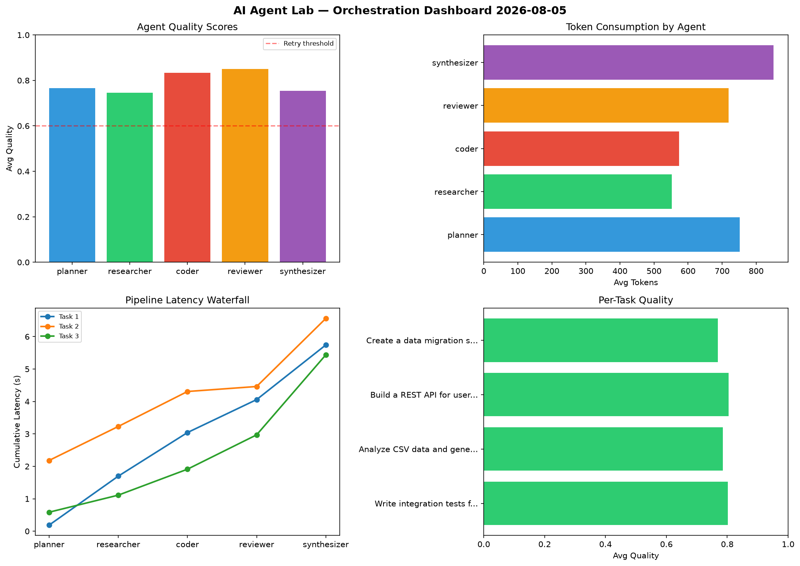

# AI Agent Lab — Orchestration Report 2026-08-05

**Run ID:** `41b157ded9` | **Tasks:** 4 | **Avg Quality:** 0.79

## Aggregate Metrics

| Metric | Value |
|--------|-------|
| avg_latency | 5.728 |
| total_tokens | 13796 |
| avg_quality | 0.79 |

## Delta vs Yesterday

| Metric | Today | Yesterday | Change |
|--------|-------|-----------|--------|
| avg_latency | 5.728 | 6.109 | 📉 -6.2% |
| total_tokens | 13796 | 14934 | 📉 -7.6% |
| avg_quality | 0.79 | 0.781 | 📈 1.2% |

## Pipeline Results

### Write integration tests for payment processing module
| Agent | Quality | Latency | Tokens | Status |
|-------|---------|---------|--------|--------|
| planner | 0.524 | 0.188s | 1180 | needs_retry |
| researcher | 0.67 | 1.51s | 711 | success |
| coder | 0.895 | 1.344s | 227 | success |
| reviewer | 0.948 | 1.016s | 488 | success |
| synthesizer | 0.973 | 1.685s | 753 | success |

### Analyze CSV data and generate statistical summary
| Agent | Quality | Latency | Tokens | Status |
|-------|---------|---------|--------|--------|
| planner | 0.914 | 2.182s | 380 | success |
| researcher | 0.502 | 1.048s | 848 | needs_retry |
| coder | 0.984 | 1.078s | 790 | success |
| reviewer | 0.818 | 0.154s | 512 | success |
| synthesizer | 0.706 | 2.098s | 1100 | success |

### Build a REST API for user authentication
| Agent | Quality | Latency | Tokens | Status |
|-------|---------|---------|--------|--------|
| planner | 0.87 | 0.586s | 616 | success |
| researcher | 0.949 | 0.526s | 252 | success |
| coder | 0.615 | 0.8s | 491 | success |
| reviewer | 0.844 | 1.059s | 966 | success |
| synthesizer | 0.741 | 2.467s | 813 | success |

### Create a data migration script for schema v2
| Agent | Quality | Latency | Tokens | Status |
|-------|---------|---------|--------|--------|
| planner | 0.757 | 0.697s | 833 | success |
| researcher | 0.861 | 1.846s | 400 | success |
| coder | 0.839 | 0.387s | 786 | success |
| reviewer | 0.79 | 0.195s | 911 | success |
| synthesizer | 0.598 | 2.045s | 739 | needs_retry |
