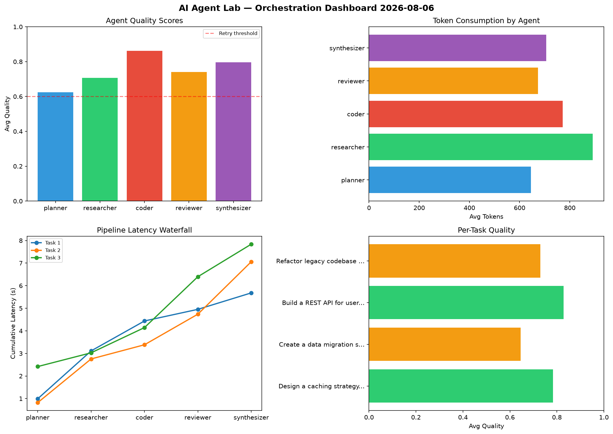

# AI Agent Lab — Orchestration Report 2026-08-06

**Run ID:** `bbf5436150` | **Tasks:** 4 | **Avg Quality:** 0.746

## Aggregate Metrics

| Metric | Value |
|--------|-------|
| avg_latency | 7.046 |
| total_tokens | 14753 |
| avg_quality | 0.746 |

## Delta vs Yesterday

| Metric | Today | Yesterday | Change |
|--------|-------|-----------|--------|
| avg_latency | 7.046 | 5.728 | 📈 23.0% |
| total_tokens | 14753 | 13796 | 📈 6.9% |
| avg_quality | 0.746 | 0.79 | 📉 -5.6% |

## Pipeline Results

### Design a caching strategy for high-traffic endpoints
| Agent | Quality | Latency | Tokens | Status |
|-------|---------|---------|--------|--------|
| planner | 0.763 | 0.991s | 495 | success |
| researcher | 0.516 | 2.12s | 1010 | needs_retry |
| coder | 0.826 | 1.326s | 505 | success |
| reviewer | 0.873 | 0.515s | 307 | success |
| synthesizer | 0.937 | 0.728s | 655 | success |

### Create a data migration script for schema v2
| Agent | Quality | Latency | Tokens | Status |
|-------|---------|---------|--------|--------|
| planner | 0.53 | 0.82s | 637 | needs_retry |
| researcher | 0.79 | 1.935s | 811 | success |
| coder | 0.864 | 0.628s | 710 | success |
| reviewer | 0.526 | 1.355s | 645 | needs_retry |
| synthesizer | 0.515 | 2.322s | 651 | needs_retry |

### Build a REST API for user authentication
| Agent | Quality | Latency | Tokens | Status |
|-------|---------|---------|--------|--------|
| planner | 0.669 | 2.418s | 926 | success |
| researcher | 0.901 | 0.609s | 927 | success |
| coder | 0.893 | 1.117s | 961 | success |
| reviewer | 0.929 | 2.253s | 665 | success |
| synthesizer | 0.746 | 1.44s | 870 | success |

### Refactor legacy codebase to use dependency injection
| Agent | Quality | Latency | Tokens | Status |
|-------|---------|---------|--------|--------|
| planner | 0.534 | 2.158s | 525 | needs_retry |
| researcher | 0.623 | 1.094s | 817 | success |
| coder | 0.864 | 2.027s | 910 | success |
| reviewer | 0.633 | 1.421s | 1077 | success |
| synthesizer | 0.989 | 0.906s | 649 | success |
