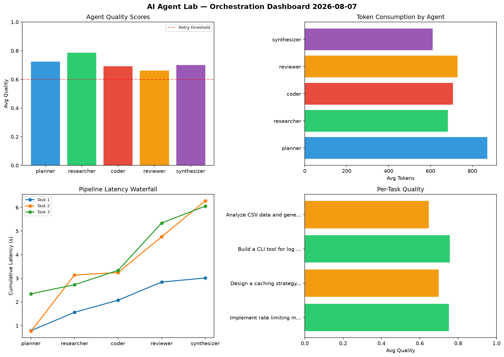

# AI Agent Lab — Orchestration Report 2026-08-07

**Run ID:** `b28fc2f930` | **Tasks:** 4 | **Avg Quality:** 0.713

## Aggregate Metrics

| Metric | Value |
|--------|-------|
| avg_latency | 5.181 |
| total_tokens | 14408 |
| avg_quality | 0.713 |

## Delta vs Yesterday

| Metric | Today | Yesterday | Change |
|--------|-------|-----------|--------|
| avg_latency | 5.181 | 6.11 | 📉 -15.2% |
| total_tokens | 14408 | 13934 | 📈 3.4% |
| avg_quality | 0.713 | 0.769 | 📉 -7.3% |

## Pipeline Results

### Implement rate limiting middleware
| Agent | Quality | Latency | Tokens | Status |
|-------|---------|---------|--------|--------|
| planner | 0.746 | 0.785s | 1013 | success |
| researcher | 0.755 | 0.776s | 1073 | success |
| coder | 0.932 | 0.514s | 1060 | success |
| reviewer | 0.605 | 0.769s | 949 | success |
| synthesizer | 0.715 | 0.17s | 907 | success |

### Design a caching strategy for high-traffic endpoints
| Agent | Quality | Latency | Tokens | Status |
|-------|---------|---------|--------|--------|
| planner | 0.503 | 0.762s | 874 | needs_retry |
| researcher | 0.873 | 2.378s | 576 | success |
| coder | 0.626 | 0.105s | 379 | success |
| reviewer | 0.656 | 1.516s | 1050 | success |
| synthesizer | 0.836 | 1.518s | 381 | success |

### Build a CLI tool for log analysis
| Agent | Quality | Latency | Tokens | Status |
|-------|---------|---------|--------|--------|
| planner | 0.836 | 2.344s | 804 | success |
| researcher | 0.894 | 0.385s | 402 | success |
| coder | 0.511 | 0.609s | 669 | needs_retry |
| reviewer | 0.862 | 2.005s | 318 | success |
| synthesizer | 0.678 | 0.712s | 492 | success |

### Analyze CSV data and generate statistical summary
| Agent | Quality | Latency | Tokens | Status |
|-------|---------|---------|--------|--------|
| planner | 0.813 | 1.883s | 796 | success |
| researcher | 0.625 | 0.488s | 682 | success |
| coder | 0.701 | 2.165s | 721 | success |
| reviewer | 0.523 | 0.272s | 601 | needs_retry |
| synthesizer | 0.571 | 0.568s | 661 | needs_retry |
