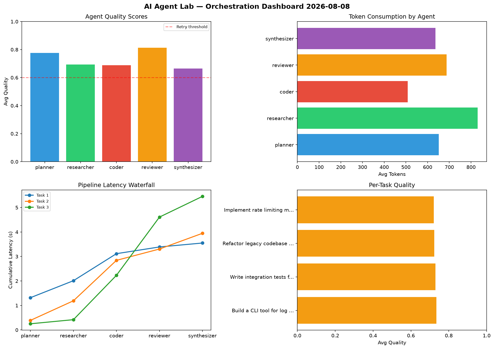

# AI Agent Lab — Orchestration Report 2026-08-08

**Run ID:** `e22e7117c7` | **Tasks:** 4 | **Avg Quality:** 0.727

## Aggregate Metrics

| Metric | Value |
|--------|-------|
| avg_latency | 5.861 |
| total_tokens | 13255 |
| avg_quality | 0.727 |

## Delta vs Yesterday

| Metric | Today | Yesterday | Change |
|--------|-------|-----------|--------|
| avg_latency | 5.861 | 6.694 | 📉 -12.4% |
| total_tokens | 13255 | 15714 | 📉 -15.6% |
| avg_quality | 0.727 | 0.774 | 📉 -6.1% |

## Pipeline Results

### Build a CLI tool for log analysis
| Agent | Quality | Latency | Tokens | Status |
|-------|---------|---------|--------|--------|
| planner | 0.823 | 1.317s | 635 | success |
| researcher | 0.869 | 0.694s | 894 | success |
| coder | 0.568 | 1.104s | 502 | needs_retry |
| reviewer | 0.583 | 0.274s | 791 | needs_retry |
| synthesizer | 0.833 | 0.161s | 658 | success |

### Write integration tests for payment processing module
| Agent | Quality | Latency | Tokens | Status |
|-------|---------|---------|--------|--------|
| planner | 0.87 | 0.39s | 528 | success |
| researcher | 0.763 | 0.801s | 527 | success |
| coder | 0.517 | 1.651s | 756 | needs_retry |
| reviewer | 0.939 | 0.463s | 184 | success |
| synthesizer | 0.56 | 0.642s | 470 | needs_retry |

### Refactor legacy codebase to use dependency injection
| Agent | Quality | Latency | Tokens | Status |
|-------|---------|---------|--------|--------|
| planner | 0.696 | 0.252s | 494 | success |
| researcher | 0.586 | 0.168s | 1208 | needs_retry |
| coder | 0.819 | 1.811s | 461 | success |
| reviewer | 0.806 | 2.378s | 902 | success |
| synthesizer | 0.706 | 0.846s | 840 | success |

### Implement rate limiting middleware
| Agent | Quality | Latency | Tokens | Status |
|-------|---------|---------|--------|--------|
| planner | 0.713 | 2.424s | 947 | success |
| researcher | 0.557 | 1.968s | 693 | needs_retry |
| coder | 0.848 | 2.242s | 316 | success |
| reviewer | 0.923 | 2.046s | 873 | success |
| synthesizer | 0.562 | 1.813s | 576 | needs_retry |
