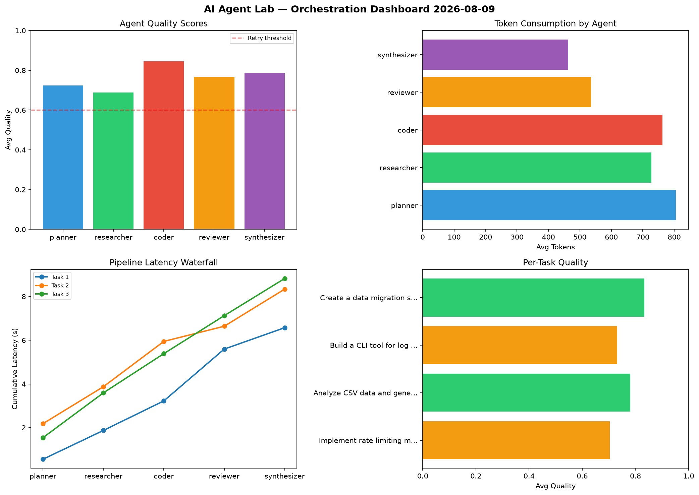

# AI Agent Lab — Orchestration Report 2026-08-09

**Run ID:** `3e0ea81013` | **Tasks:** 4 | **Avg Quality:** 0.762

## Aggregate Metrics

| Metric | Value |
|--------|-------|
| avg_latency | 7.666 |
| total_tokens | 13175 |
| avg_quality | 0.762 |

## Delta vs Yesterday

| Metric | Today | Yesterday | Change |
|--------|-------|-----------|--------|
| avg_latency | 7.666 | 6.821 | 📈 12.4% |
| total_tokens | 13175 | 13792 | 📉 -4.5% |
| avg_quality | 0.762 | 0.73 | 📈 4.4% |

## Pipeline Results

### Implement rate limiting middleware
| Agent | Quality | Latency | Tokens | Status |
|-------|---------|---------|--------|--------|
| planner | 0.727 | 0.555s | 637 | success |
| researcher | 0.625 | 1.316s | 710 | success |
| coder | 0.789 | 1.352s | 801 | success |
| reviewer | 0.818 | 2.371s | 529 | success |
| synthesizer | 0.554 | 0.978s | 414 | needs_retry |

### Analyze CSV data and generate statistical summary
| Agent | Quality | Latency | Tokens | Status |
|-------|---------|---------|--------|--------|
| planner | 0.542 | 2.182s | 1201 | needs_retry |
| researcher | 0.719 | 1.69s | 390 | success |
| coder | 0.971 | 2.073s | 502 | success |
| reviewer | 0.851 | 0.694s | 432 | success |
| synthesizer | 0.822 | 1.697s | 731 | success |

### Build a CLI tool for log analysis
| Agent | Quality | Latency | Tokens | Status |
|-------|---------|---------|--------|--------|
| planner | 0.75 | 1.54s | 765 | success |
| researcher | 0.703 | 2.051s | 817 | success |
| coder | 0.691 | 1.794s | 635 | success |
| reviewer | 0.677 | 1.738s | 525 | success |
| synthesizer | 0.833 | 1.7s | 410 | success |

### Create a data migration script for schema v2
| Agent | Quality | Latency | Tokens | Status |
|-------|---------|---------|--------|--------|
| planner | 0.879 | 2.443s | 619 | success |
| researcher | 0.706 | 0.461s | 992 | success |
| coder | 0.928 | 0.509s | 1111 | success |
| reviewer | 0.72 | 2.018s | 657 | success |
| synthesizer | 0.934 | 1.5s | 297 | success |
