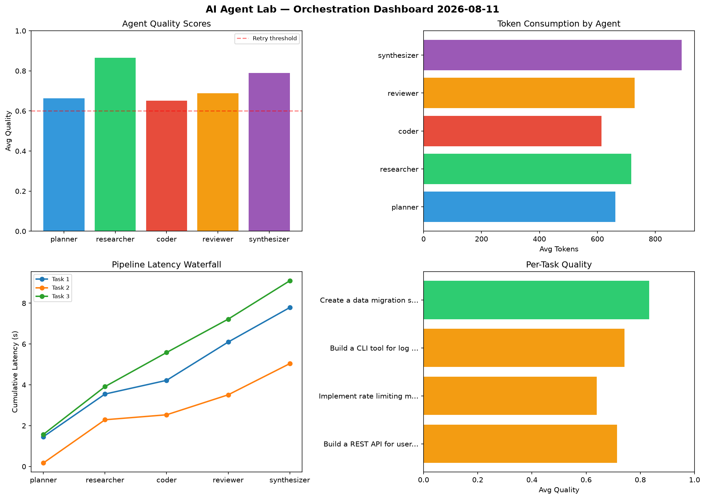

# AI Agent Lab — Orchestration Report 2026-08-11

**Run ID:** `0901372015` | **Tasks:** 4 | **Avg Quality:** 0.732

## Aggregate Metrics

| Metric | Value |
|--------|-------|
| avg_latency | 6.826 |
| total_tokens | 14449 |
| avg_quality | 0.732 |

## Delta vs Yesterday

| Metric | Today | Yesterday | Change |
|--------|-------|-----------|--------|
| avg_latency | 6.826 | 6.466 | 📈 5.6% |
| total_tokens | 14449 | 14881 | 📉 -2.9% |
| avg_quality | 0.732 | 0.733 | 📉 -0.1% |

## Pipeline Results

### Build a REST API for user authentication
| Agent | Quality | Latency | Tokens | Status |
|-------|---------|---------|--------|--------|
| planner | 0.537 | 1.462s | 831 | needs_retry |
| researcher | 0.898 | 2.088s | 764 | success |
| coder | 0.696 | 0.671s | 205 | success |
| reviewer | 0.747 | 1.877s | 936 | success |
| synthesizer | 0.69 | 1.689s | 893 | success |

### Implement rate limiting middleware
| Agent | Quality | Latency | Tokens | Status |
|-------|---------|---------|--------|--------|
| planner | 0.587 | 0.175s | 463 | needs_retry |
| researcher | 0.852 | 2.116s | 488 | success |
| coder | 0.662 | 0.243s | 737 | success |
| reviewer | 0.563 | 0.979s | 389 | needs_retry |
| synthesizer | 0.529 | 1.527s | 778 | needs_retry |

### Build a CLI tool for log analysis
| Agent | Quality | Latency | Tokens | Status |
|-------|---------|---------|--------|--------|
| planner | 0.719 | 1.576s | 661 | success |
| researcher | 0.833 | 2.339s | 811 | success |
| coder | 0.518 | 1.671s | 754 | needs_retry |
| reviewer | 0.665 | 1.634s | 873 | success |
| synthesizer | 0.968 | 1.879s | 819 | success |

### Create a data migration script for schema v2
| Agent | Quality | Latency | Tokens | Status |
|-------|---------|---------|--------|--------|
| planner | 0.81 | 1.289s | 691 | success |
| researcher | 0.881 | 1.144s | 806 | success |
| coder | 0.726 | 1.092s | 762 | success |
| reviewer | 0.777 | 0.914s | 715 | success |
| synthesizer | 0.972 | 0.939s | 1073 | success |
