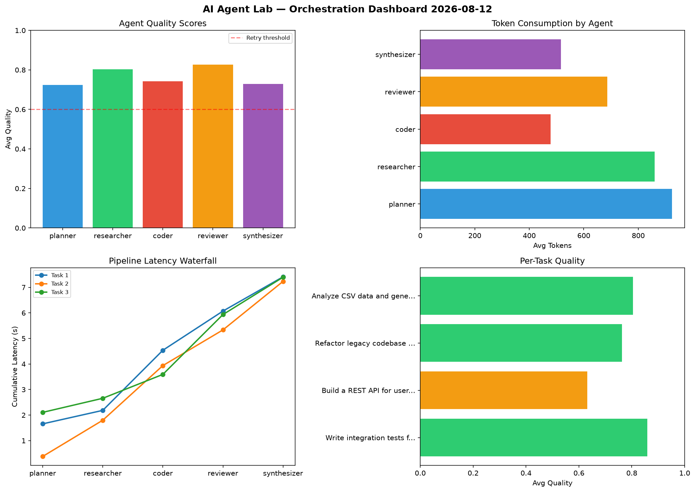

# AI Agent Lab — Orchestration Report 2026-08-12

**Run ID:** `b208c21808` | **Tasks:** 4 | **Avg Quality:** 0.765

## Aggregate Metrics

| Metric | Value |
|--------|-------|
| avg_latency | 7.413 |
| total_tokens | 13860 |
| avg_quality | 0.765 |

## Delta vs Yesterday

| Metric | Today | Yesterday | Change |
|--------|-------|-----------|--------|
| avg_latency | 7.413 | 6.859 | 📈 8.1% |
| total_tokens | 13860 | 14939 | 📉 -7.2% |
| avg_quality | 0.765 | 0.778 | 📉 -1.7% |

## Pipeline Results

### Write integration tests for payment processing module
| Agent | Quality | Latency | Tokens | Status |
|-------|---------|---------|--------|--------|
| planner | 0.539 | 1.656s | 914 | needs_retry |
| researcher | 0.978 | 0.528s | 1027 | success |
| coder | 0.861 | 2.353s | 385 | success |
| reviewer | 0.943 | 1.534s | 366 | success |
| synthesizer | 0.973 | 1.341s | 934 | success |

### Build a REST API for user authentication
| Agent | Quality | Latency | Tokens | Status |
|-------|---------|---------|--------|--------|
| planner | 0.832 | 0.38s | 763 | success |
| researcher | 0.549 | 1.418s | 849 | needs_retry |
| coder | 0.575 | 2.139s | 196 | needs_retry |
| reviewer | 0.698 | 1.397s | 545 | success |
| synthesizer | 0.508 | 1.899s | 335 | needs_retry |

### Refactor legacy codebase to use dependency injection
| Agent | Quality | Latency | Tokens | Status |
|-------|---------|---------|--------|--------|
| planner | 0.916 | 2.106s | 988 | success |
| researcher | 0.908 | 0.551s | 521 | success |
| coder | 0.682 | 0.935s | 634 | success |
| reviewer | 0.763 | 2.343s | 717 | success |
| synthesizer | 0.548 | 1.461s | 342 | needs_retry |

### Analyze CSV data and generate statistical summary
| Agent | Quality | Latency | Tokens | Status |
|-------|---------|---------|--------|--------|
| planner | 0.606 | 1.485s | 1031 | success |
| researcher | 0.778 | 1.879s | 1044 | success |
| coder | 0.849 | 2.173s | 697 | success |
| reviewer | 0.904 | 1.482s | 1116 | success |
| synthesizer | 0.887 | 0.591s | 456 | success |
