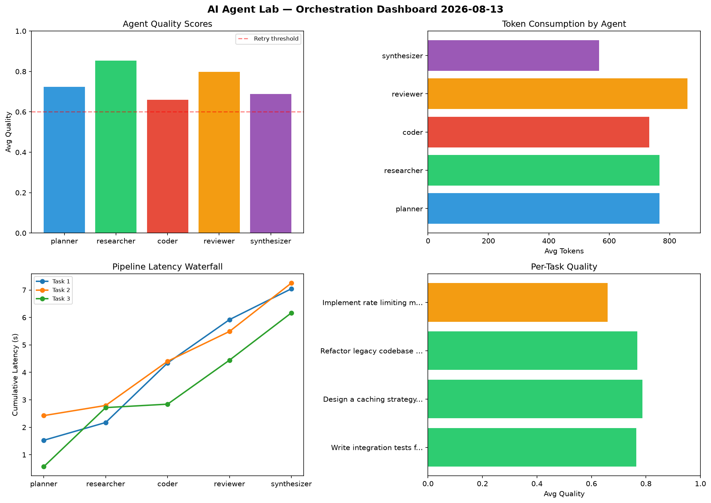

# AI Agent Lab — Orchestration Report 2026-08-13

**Run ID:** `e19ef71046` | **Tasks:** 4 | **Avg Quality:** 0.745

## Aggregate Metrics

| Metric | Value |
|--------|-------|
| avg_latency | 6.553 |
| total_tokens | 14768 |
| avg_quality | 0.745 |

## Delta vs Yesterday

| Metric | Today | Yesterday | Change |
|--------|-------|-----------|--------|
| avg_latency | 6.553 | 6.537 | 📈 0.2% |
| total_tokens | 14768 | 13073 | 📈 13.0% |
| avg_quality | 0.745 | 0.753 | 📉 -1.1% |

## Pipeline Results

### Write integration tests for payment processing module
| Agent | Quality | Latency | Tokens | Status |
|-------|---------|---------|--------|--------|
| planner | 0.753 | 1.526s | 664 | success |
| researcher | 0.852 | 0.648s | 1092 | success |
| coder | 0.631 | 2.169s | 937 | success |
| reviewer | 0.893 | 1.578s | 777 | success |
| synthesizer | 0.694 | 1.124s | 504 | success |

### Design a caching strategy for high-traffic endpoints
| Agent | Quality | Latency | Tokens | Status |
|-------|---------|---------|--------|--------|
| planner | 0.665 | 2.425s | 824 | success |
| researcher | 0.945 | 0.37s | 983 | success |
| coder | 0.783 | 1.609s | 826 | success |
| reviewer | 0.668 | 1.087s | 851 | success |
| synthesizer | 0.872 | 1.763s | 917 | success |

### Refactor legacy codebase to use dependency injection
| Agent | Quality | Latency | Tokens | Status |
|-------|---------|---------|--------|--------|
| planner | 0.959 | 0.566s | 495 | success |
| researcher | 0.705 | 2.151s | 464 | success |
| coder | 0.645 | 0.125s | 487 | success |
| reviewer | 0.956 | 1.603s | 1102 | success |
| synthesizer | 0.576 | 1.723s | 399 | needs_retry |

### Implement rate limiting middleware
| Agent | Quality | Latency | Tokens | Status |
|-------|---------|---------|--------|--------|
| planner | 0.521 | 2.077s | 1084 | needs_retry |
| researcher | 0.91 | 0.746s | 529 | success |
| coder | 0.577 | 0.166s | 680 | needs_retry |
| reviewer | 0.672 | 2.428s | 707 | success |
| synthesizer | 0.614 | 0.327s | 446 | success |
