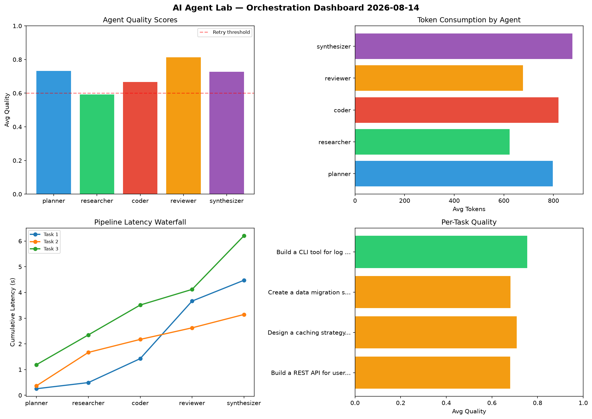

# AI Agent Lab — Orchestration Report 2026-08-14

**Run ID:** `d27b542445` | **Tasks:** 4 | **Avg Quality:** 0.706

## Aggregate Metrics

| Metric | Value |
|--------|-------|
| avg_latency | 4.166 |
| total_tokens | 15180 |
| avg_quality | 0.706 |

## Delta vs Yesterday

| Metric | Today | Yesterday | Change |
|--------|-------|-----------|--------|
| avg_latency | 4.166 | 6.553 | 📉 -36.4% |
| total_tokens | 15180 | 14768 | 📈 2.8% |
| avg_quality | 0.706 | 0.745 | 📉 -5.2% |

## Pipeline Results

### Build a REST API for user authentication
| Agent | Quality | Latency | Tokens | Status |
|-------|---------|---------|--------|--------|
| planner | 0.522 | 0.255s | 718 | needs_retry |
| researcher | 0.51 | 0.239s | 364 | needs_retry |
| coder | 0.502 | 0.932s | 865 | needs_retry |
| reviewer | 0.939 | 2.239s | 454 | success |
| synthesizer | 0.927 | 0.809s | 867 | success |

### Design a caching strategy for high-traffic endpoints
| Agent | Quality | Latency | Tokens | Status |
|-------|---------|---------|--------|--------|
| planner | 0.871 | 0.369s | 882 | success |
| researcher | 0.531 | 1.299s | 670 | needs_retry |
| coder | 0.616 | 0.506s | 1219 | success |
| reviewer | 0.713 | 0.45s | 885 | success |
| synthesizer | 0.814 | 0.519s | 498 | success |

### Create a data migration script for schema v2
| Agent | Quality | Latency | Tokens | Status |
|-------|---------|---------|--------|--------|
| planner | 0.714 | 1.19s | 680 | success |
| researcher | 0.765 | 1.159s | 580 | success |
| coder | 0.609 | 1.162s | 466 | success |
| reviewer | 0.739 | 0.608s | 742 | success |
| synthesizer | 0.578 | 2.087s | 1048 | needs_retry |

### Build a CLI tool for log analysis
| Agent | Quality | Latency | Tokens | Status |
|-------|---------|---------|--------|--------|
| planner | 0.821 | 0.838s | 911 | success |
| researcher | 0.564 | 0.419s | 880 | needs_retry |
| coder | 0.938 | 0.411s | 732 | success |
| reviewer | 0.86 | 0.283s | 628 | success |
| synthesizer | 0.592 | 0.889s | 1091 | needs_retry |
