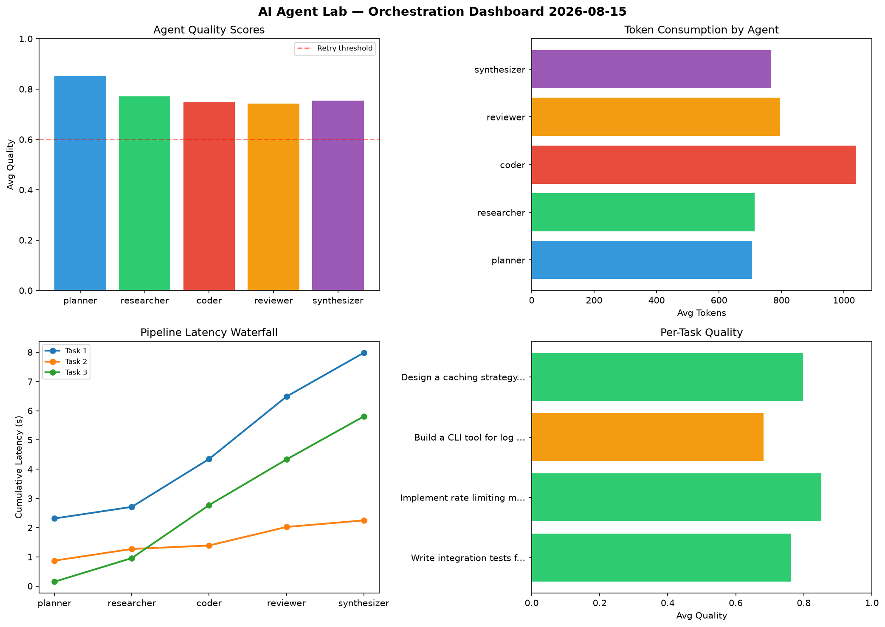

# AI Agent Lab — Orchestration Report 2026-08-15

**Run ID:** `2cb8ee66bd` | **Tasks:** 4 | **Avg Quality:** 0.773

## Aggregate Metrics

| Metric | Value |
|--------|-------|
| avg_latency | 5.354 |
| total_tokens | 16076 |
| avg_quality | 0.773 |

## Delta vs Yesterday

| Metric | Today | Yesterday | Change |
|--------|-------|-----------|--------|
| avg_latency | 5.354 | 4.166 | 📈 28.5% |
| total_tokens | 16076 | 15180 | 📈 5.9% |
| avg_quality | 0.773 | 0.706 | 📈 9.5% |

## Pipeline Results

### Write integration tests for payment processing module
| Agent | Quality | Latency | Tokens | Status |
|-------|---------|---------|--------|--------|
| planner | 0.565 | 2.313s | 1130 | needs_retry |
| researcher | 0.83 | 0.397s | 743 | success |
| coder | 1.0 | 1.639s | 1059 | success |
| reviewer | 0.545 | 2.134s | 750 | needs_retry |
| synthesizer | 0.872 | 1.499s | 1047 | success |

### Implement rate limiting middleware
| Agent | Quality | Latency | Tokens | Status |
|-------|---------|---------|--------|--------|
| planner | 0.926 | 0.871s | 422 | success |
| researcher | 0.923 | 0.399s | 1089 | success |
| coder | 0.871 | 0.119s | 895 | success |
| reviewer | 0.802 | 0.633s | 1116 | success |
| synthesizer | 0.737 | 0.226s | 620 | success |

### Build a CLI tool for log analysis
| Agent | Quality | Latency | Tokens | Status |
|-------|---------|---------|--------|--------|
| planner | 0.94 | 0.15s | 764 | success |
| researcher | 0.538 | 0.808s | 567 | needs_retry |
| coder | 0.515 | 1.814s | 1147 | needs_retry |
| reviewer | 0.629 | 1.56s | 775 | success |
| synthesizer | 0.786 | 1.472s | 502 | success |

### Design a caching strategy for high-traffic endpoints
| Agent | Quality | Latency | Tokens | Status |
|-------|---------|---------|--------|--------|
| planner | 0.977 | 0.71s | 507 | success |
| researcher | 0.796 | 1.475s | 456 | success |
| coder | 0.604 | 0.87s | 1049 | success |
| reviewer | 0.992 | 1.847s | 539 | success |
| synthesizer | 0.62 | 0.48s | 899 | success |
