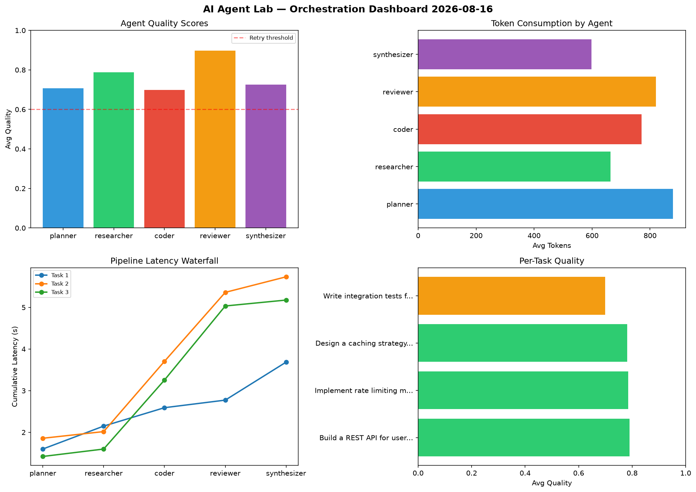

# AI Agent Lab — Orchestration Report 2026-08-16

**Run ID:** `69e6e247c8` | **Tasks:** 4 | **Avg Quality:** 0.764

## Aggregate Metrics

| Metric | Value |
|--------|-------|
| avg_latency | 5.168 |
| total_tokens | 14926 |
| avg_quality | 0.764 |

## Delta vs Yesterday

| Metric | Today | Yesterday | Change |
|--------|-------|-----------|--------|
| avg_latency | 5.168 | 6.733 | 📉 -23.2% |
| total_tokens | 14926 | 15362 | 📉 -2.8% |
| avg_quality | 0.764 | 0.73 | 📈 4.7% |

## Pipeline Results

### Build a REST API for user authentication
| Agent | Quality | Latency | Tokens | Status |
|-------|---------|---------|--------|--------|
| planner | 0.889 | 1.599s | 767 | success |
| researcher | 0.808 | 0.55s | 878 | success |
| coder | 0.632 | 0.442s | 986 | success |
| reviewer | 0.912 | 0.182s | 948 | success |
| synthesizer | 0.71 | 0.912s | 390 | success |

### Implement rate limiting middleware
| Agent | Quality | Latency | Tokens | Status |
|-------|---------|---------|--------|--------|
| planner | 0.742 | 1.857s | 571 | success |
| researcher | 0.854 | 0.16s | 423 | success |
| coder | 0.76 | 1.687s | 572 | success |
| reviewer | 0.829 | 1.657s | 853 | success |
| synthesizer | 0.738 | 0.373s | 713 | success |

### Design a caching strategy for high-traffic endpoints
| Agent | Quality | Latency | Tokens | Status |
|-------|---------|---------|--------|--------|
| planner | 0.573 | 1.42s | 965 | needs_retry |
| researcher | 0.859 | 0.178s | 652 | success |
| coder | 0.645 | 1.657s | 871 | success |
| reviewer | 0.945 | 1.779s | 968 | success |
| synthesizer | 0.881 | 0.142s | 685 | success |

### Write integration tests for payment processing module
| Agent | Quality | Latency | Tokens | Status |
|-------|---------|---------|--------|--------|
| planner | 0.627 | 0.224s | 1212 | success |
| researcher | 0.633 | 1.24s | 702 | success |
| coder | 0.757 | 2.119s | 652 | success |
| reviewer | 0.902 | 1.73s | 513 | success |
| synthesizer | 0.575 | 0.762s | 605 | needs_retry |
