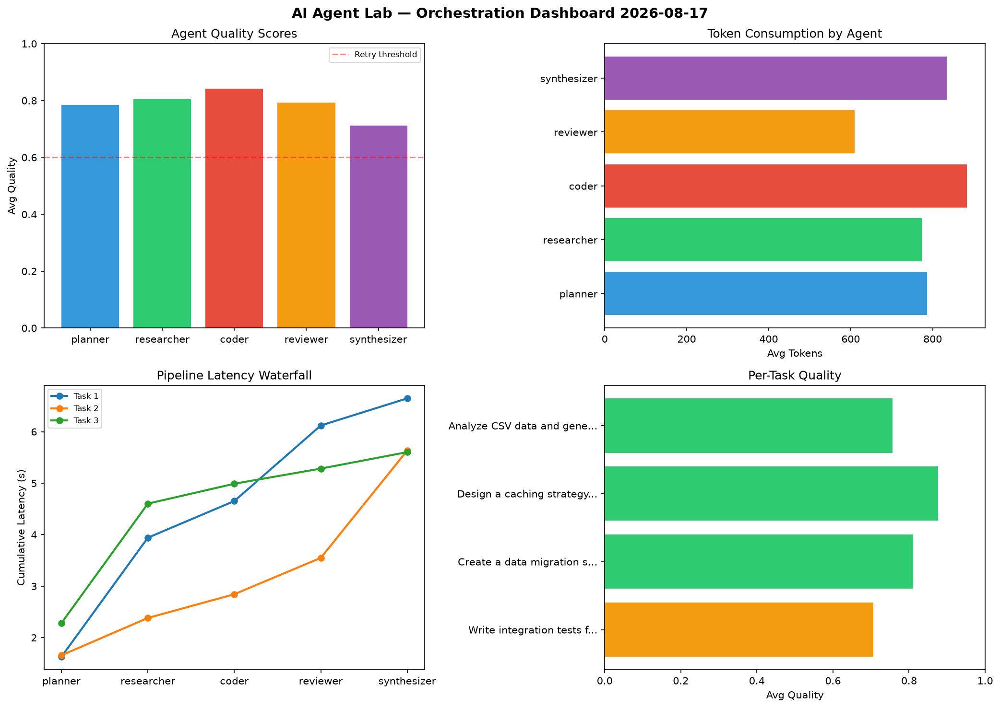

# AI Agent Lab — Orchestration Report 2026-08-17

**Run ID:** `66142ceba2` | **Tasks:** 4 | **Avg Quality:** 0.787

## Aggregate Metrics

| Metric | Value |
|--------|-------|
| avg_latency | 5.96 |
| total_tokens | 15546 |
| avg_quality | 0.787 |

## Delta vs Yesterday

| Metric | Today | Yesterday | Change |
|--------|-------|-----------|--------|
| avg_latency | 5.96 | 5.168 | 📈 15.3% |
| total_tokens | 15546 | 14926 | 📈 4.2% |
| avg_quality | 0.787 | 0.764 | 📈 3.0% |

## Pipeline Results

### Write integration tests for payment processing module
| Agent | Quality | Latency | Tokens | Status |
|-------|---------|---------|--------|--------|
| planner | 0.898 | 1.627s | 534 | success |
| researcher | 0.831 | 2.314s | 458 | success |
| coder | 0.616 | 0.712s | 896 | success |
| reviewer | 0.676 | 1.467s | 347 | success |
| synthesizer | 0.508 | 0.527s | 623 | needs_retry |

### Create a data migration script for schema v2
| Agent | Quality | Latency | Tokens | Status |
|-------|---------|---------|--------|--------|
| planner | 0.651 | 1.657s | 389 | success |
| researcher | 0.881 | 0.725s | 876 | success |
| coder | 0.907 | 0.461s | 1233 | success |
| reviewer | 0.98 | 0.706s | 473 | success |
| synthesizer | 0.636 | 2.085s | 1133 | success |

### Design a caching strategy for high-traffic endpoints
| Agent | Quality | Latency | Tokens | Status |
|-------|---------|---------|--------|--------|
| planner | 0.754 | 2.282s | 1217 | success |
| researcher | 0.846 | 2.32s | 1033 | success |
| coder | 0.986 | 0.387s | 683 | success |
| reviewer | 0.925 | 0.294s | 645 | success |
| synthesizer | 0.867 | 0.32s | 556 | success |

### Analyze CSV data and generate statistical summary
| Agent | Quality | Latency | Tokens | Status |
|-------|---------|---------|--------|--------|
| planner | 0.836 | 0.453s | 1003 | success |
| researcher | 0.66 | 2.036s | 728 | success |
| coder | 0.858 | 1.578s | 723 | success |
| reviewer | 0.589 | 0.622s | 972 | needs_retry |
| synthesizer | 0.835 | 1.269s | 1024 | success |
