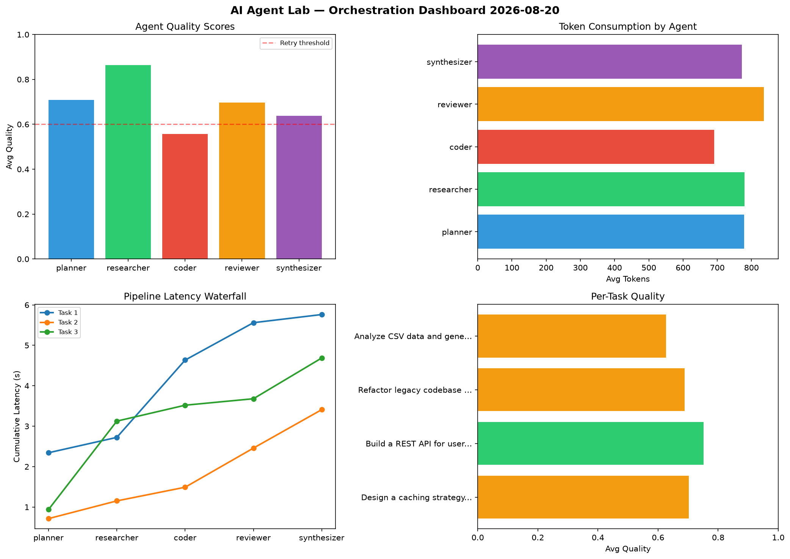

# AI Agent Lab — Orchestration Report 2026-08-20

**Run ID:** `9dd22c4c59` | **Tasks:** 4 | **Avg Quality:** 0.692

## Aggregate Metrics

| Metric | Value |
|--------|-------|
| avg_latency | 4.926 |
| total_tokens | 15435 |
| avg_quality | 0.692 |

## Delta vs Yesterday

| Metric | Today | Yesterday | Change |
|--------|-------|-----------|--------|
| avg_latency | 4.926 | 6.849 | 📉 -28.1% |
| total_tokens | 15435 | 15215 | 📈 1.4% |
| avg_quality | 0.692 | 0.752 | 📉 -8.0% |

## Pipeline Results

### Design a caching strategy for high-traffic endpoints
| Agent | Quality | Latency | Tokens | Status |
|-------|---------|---------|--------|--------|
| planner | 0.689 | 2.343s | 1061 | success |
| researcher | 0.774 | 0.38s | 981 | success |
| coder | 0.592 | 1.912s | 505 | needs_retry |
| reviewer | 0.868 | 0.925s | 847 | success |
| synthesizer | 0.585 | 0.202s | 379 | needs_retry |

### Build a REST API for user authentication
| Agent | Quality | Latency | Tokens | Status |
|-------|---------|---------|--------|--------|
| planner | 0.939 | 0.714s | 516 | success |
| researcher | 0.873 | 0.438s | 955 | success |
| coder | 0.509 | 0.338s | 830 | needs_retry |
| reviewer | 0.85 | 0.968s | 799 | success |
| synthesizer | 0.587 | 0.951s | 598 | needs_retry |

### Refactor legacy codebase to use dependency injection
| Agent | Quality | Latency | Tokens | Status |
|-------|---------|---------|--------|--------|
| planner | 0.632 | 0.938s | 990 | success |
| researcher | 0.917 | 2.187s | 887 | success |
| coder | 0.599 | 0.394s | 847 | needs_retry |
| reviewer | 0.523 | 0.16s | 555 | needs_retry |
| synthesizer | 0.776 | 1.008s | 1137 | success |

### Analyze CSV data and generate statistical summary
| Agent | Quality | Latency | Tokens | Status |
|-------|---------|---------|--------|--------|
| planner | 0.573 | 0.801s | 549 | needs_retry |
| researcher | 0.888 | 0.145s | 298 | success |
| coder | 0.525 | 1.778s | 583 | needs_retry |
| reviewer | 0.543 | 1.802s | 1145 | needs_retry |
| synthesizer | 0.605 | 1.32s | 973 | success |
